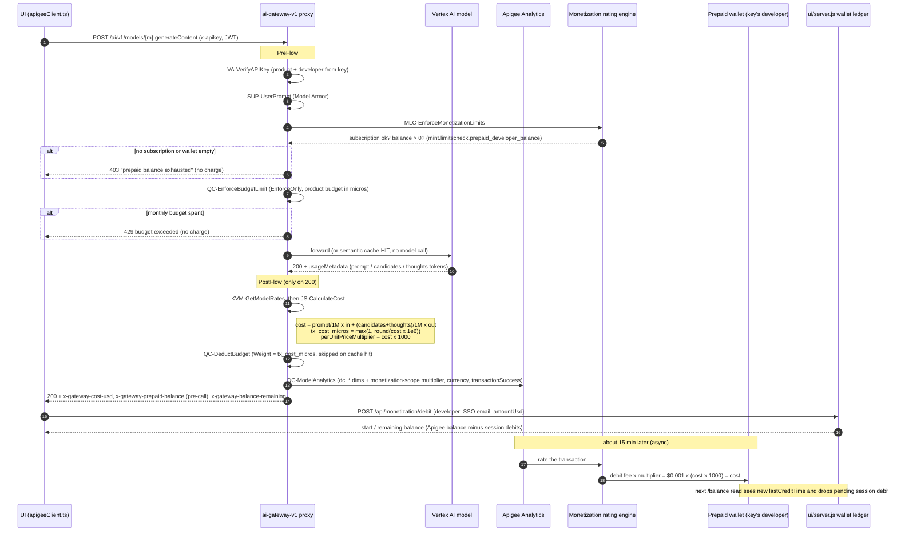

# How an AI Gateway call reaches the Monetization prepaid wallet

Checked against the repo and live Apigee org `your-gcp-project` on 2026-09-29.

## TL;DR

- **One price, three consumers.** The proxy prices every successful call once, in
  [CalculateCost.js](../apigee/proxies/ai-gateway-v1/apiproxy/resources/jsc/CalculateCost.js):
  tokens × the model's rate from the `ai-model-rates` KVM. That single number feeds three
  independent ledgers:
  1. **Prepaid wallet** (Apigee Monetization). Debited **asynchronously**, about 15 min later,
     from Analytics.
  2. **Budget counter** (Quota policy, micro-dollars). Deducted **synchronously**, on the same call.
  3. **Analytics** (custom dimensions). The source for the Analytics & Cost dashboards.
- **Which wallet:** the wallet of the **developer who owns the API key's app**. It is not the
  signed-in user, unless they happen to be the same person.
- **The UI adds a bridge.** Apigee's wallet balance lags traffic, so `ui/server.js` keeps a
  per-session debit ledger and subtracts it from the balance Apigee reports. The chips then move
  on every call.

## Per-call sequence

## The rating maths

Every persona product has a published rate plan, `<Product> PayAsYouGo`, verified live:
`MONTHLY`, `USD`, `FIXED_PER_UNIT`, fee **$0.001** per unit (`nanos: 1000000`). Each developer's
`monetizationConfig` is `billingType: PREPAID`.

Monetization charges `fee × perUnitPriceMultiplier`, so the proxy sets the multiplier to
`cost × 1000`, and the wallet is debited exactly the model cost.

**Worked example:** `gemini-3.1-pro-preview` at $2.00 in / $12.00 out per 1M tokens, with
1,000 prompt tokens and 500 output tokens (candidates + thoughts).

| Step | Value |
| --- | --- |
| Input cost | 1,000 / 1M × $2.00 = $0.00200 |
| Output cost | 500 / 1M × $12.00 = $0.00600 |
| `flow.tx_cost_usd` → `x-gateway-cost-usd` | **$0.008000** |
| `perUnitPriceMultiplier` | 8.00 |
| Wallet debit (async) | $0.001 × 8.00 = **$0.00800** |
| Budget counter weight (sync) | 8,000 micros |
| UI session debit | $0.00800 against the SSO user's ledger |

Thinking tokens are billed at the **output** rate, so reasoning models cost what Vertex
actually charges.

## What is charged, and where

| Call outcome | Wallet (Monetization) | Budget counter | Analytics / dashboards | UI live balance |
| --- | --- | --- | --- | --- |
| 200, model call, priced | **cost** | cost (micros, min 1) | tokens + model | − cost |
| 200, semantic cache **HIT** | $0 (`transactionSuccess=false`, multiplier 0) | skipped | tokens, `HIT` | − $0 |
| 200, model not listed in the rate card | **cost at the card's `default` rate** (live: $0.15 in / $0.60 out per 1M, tier medium) | cost (micros, min 1) | tokens + model | − cost |
| 200 but the rate card could not be read (KVM missing, invalid JSON, no `default` entry) | $0 (`transactionSuccess=false`) | skipped | recorded, `x-gateway-cost-source` names the gap | − $0 |
| Any fault: 401 key / product, 400 Model Armor, 403 MLC, 429 budget or token quota, upstream error | $0 (fault path omits monetization collectors) | not deducted | `DC-FaultAnalytics` row | no debit |
| **MCP tool call** (`/mcp`, tools proxies) | **$0**: the MCP proxies have no monetization policies | n/a (per-tool call quotas instead) | tool analytics | no debit |

## The three ledgers side by side

| | Prepaid wallet | Budget counter | Analytics |
| --- | --- | --- | --- |
| Owner | Apigee Monetization, per **developer** | Quota `developer-budget-counter`, per **developer id** | Apigee Analytics |
| Limit | Wallet balance (top-ups) | Product attribute `developer.budget.limit`, verified live: Eng & IT $20, Analysts $10, Support & Sales $5 per month | none |
| Timing | Async, ~15 min | Sync, same call | Async, minutes |
| Block | 403 from `MLC-EnforceMonetizationLimits` | 429 from `RF-BudgetExceeded` | none |
| Shown in UI | Monetization tab balance, trace "prepaid balance" chips | `x-gateway-budget-*` headers | Analytics & Cost, Agent Analytics |

## The UI's live-balance bridge

- **`GET /api/monetization/balance?dev=`** reads the Apigee wallet and subtracts that developer's
  pending session debits
  ([walletLedger.js](../ui/server/walletLedger.js)
  `applyLedgerToBalance`).
- **`POST /api/monetization/debit`** is called by
  [apigeeClient.ts](../ui/src/services/apigeeClient.ts#L336-L361)
  after every 2xx, with `x-gateway-cost-usd` (0 on a cache hit). It returns start and remaining
  balances.
- **Reconciliation:** when Apigee's `lastCreditTime` changes (settlement or top-up), the pending
  debits are dropped, because Apigee's own balance now includes them.
- **The ledger is in memory:** a Cloud Run restart or a second instance loses pending debits
  until the next settlement. That is harmless, because the next Apigee read is correct.

## Design decisions

1. **MCP tool calls are not charged.** Only `ai-gateway-v1` has `MonetizationLimitsCheck` and
   monetization-scope collectors. The UI shows AI Gateway consumption charges only; tool calls are
   governed by per-tool call quotas on the MCP products.
2. **Cache hits cost $0 everywhere.** `CalculateCost.js` sets `perUnitPriceMultiplier=0` and
   `transactionSuccess=false` on a hit. Before 2026-09-29 it left them unset, and
   `DC-ModelAnalytics` then fell back to its defaults (1.0 / true), rating every hit as one $0.001
   unit against the wallet.
3. **Demo simplification: persona keys vs the signed-in user.**
   - The Sales and Loans keys belong to one persona developer (`persona.owner@example.com`), so
     Apigee debits that wallet.
   - The UI's live session debit is keyed by the signed-in SSO email. For Admin-key calls the two
     are the same wallet; for persona calls the live chip moves on the SSO user's wallet until
     settlement.
   - In a real deployment each user has their own app, key and wallet, so the key owner and the
     signed-in user coincide.
4. **`x-gateway-prepaid-balance` is the balance before the call**, as MLC read it, and it lags
   settlement. `x-gateway-balance-remaining` is that figure minus this call. The UI overwrites
   both with the session-ledger values when the server can read Apigee.
5. **Starting credit is $20 everywhere:** `provision_unified_credentials.py` and the UI's
   onboarding path (`PREPAID_STARTING_BALANCE_USD`). It is separate from the monthly budget
   counter.

## Where it lives

| Piece | File |
| --- | --- |
| Flow order | `apigee/proxies/ai-gateway-v1/apiproxy/proxies/default.xml` |
| Wallet gate | `policies/MLC-EnforceMonetizationLimits.xml` |
| Budget gate / deduct | `policies/QC-EnforceBudgetLimit.xml`, `policies/QC-DeductBudget.xml` |
| Pricing and multiplier | `resources/jsc/CalculateCost.js` |
| Rating record | `policies/DC-ModelAnalytics.xml` (success), `policies/DC-FaultAnalytics.xml` (faults, no monetization) |
| Response headers | `policies/AM-SetResponseHeaders.xml` |
| Rate plans, prepaid config, top-up | `apigee/scripts/provision_unified_credentials.py` (`sync_monetization`), `ui/server.js` `/api/me/onboard` |
| UI bridge | `ui/server/walletLedger.js`, `ui/server.js` `/api/monetization/*`, `ui/src/services/apigeeClient.ts` |
| Existing reference | `docs/unified_credentials_and_products_reference.md` §6–7 |
