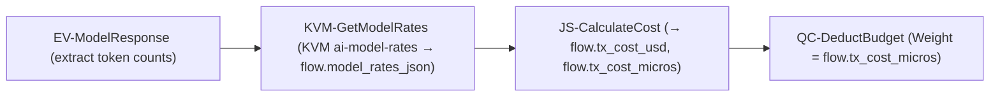
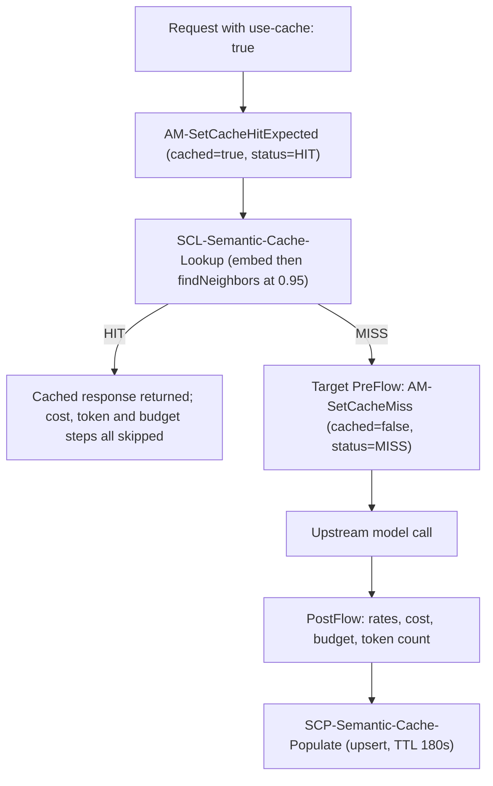

# AI Gateway — Apigee Proxy Architecture

> **Document status**: Reconciled against the proxy bundle source on disk.
> **Primary bundle**: `ai-gateway-v1`
> **Apigee organization**: `your-gcp-project` · **Environments**: `dev`, `prod`
> **Base path**: `/ai/v1` (see [default.xml](../apigee/proxies/ai-gateway-v1/apiproxy/proxies/default.xml#L272-L275))
> **Public host**: `https://api.example.com/ai/v1`
> **Deployed revision**: last recorded in commit `7c881ad` as rev `53` in `prod`
> and rev `54` in `dev` (the JEV router + encrypted-KVM change). The revision
> history was reset on 2026-09-15 — all 57 prior revisions were deleted and the
> bundle re-imported as revision 1 — so revision numbers before that date do not
> correspond to the current history.

Every policy name, flow condition, header and variable in this document was read
directly out of the bundle. Anything not implemented is in
[Section 11 — Not Implemented](#11-not-implemented--roadmap) and is explicitly
labelled as such.

---

## 1. Bundle Inventory

| Bundle | Path | Status |
| :--- | :--- | :--- |
| `ai-gateway-v1` | [apigee/proxies/ai-gateway-v1](../apigee/proxies/ai-gateway-v1) | **Primary / active.** All AI Gateway work lands here |
| `mcp` | *(intentionally not in repo)* | **UI-managed.** The native MCP Tools Gateway (`/mcp`, Customer Service / Business Insights / Enterprise tools) is created, edited and deployed in the Apigee UI. Its source is deliberately kept out of the repo: pushing a repo bundle over it previously broke the UI-managed configuration. `deploy_proxy.sh` refuses `--proxy mcp`, and `ui/tests/proxybundle.unit.test.mjs` asserts no `apigee/proxies/mcp` exists. `customer_service_tools_mcp.json`, `business_insights_tools_mcp.json` and `enterprise_tools_mcp.json` reference `apiSource: "mcp"`. Its Customer Service / Business Insights tools were added in the Apigee UI (**Add tool**) from the OpenAPI specs API hub syncs from the two REST proxies below; the dev `mcp-dev` proxy has no governance policies, so MCP testing happens in prod |
| `bigquery-mcp` | [apigee/proxies/bigquery-mcp](../apigee/proxies/bigquery-mcp) | **Active.** Dedicated BigQuery MCP Tools Gateway |
| `servicenow-mcp` | [apigee/proxies/servicenow-mcp](../apigee/proxies/servicenow-mcp) | **Active.** Dedicated ServiceNow Incident Management Gateway |
| `customer-service-v1` | [apigee/proxies/customer-service-v1](../apigee/proxies/customer-service-v1) | **Active, generated** by [gen_business_proxies.py](../apigee/scripts/gen_business_proxies.py). Private REST proxy (`/customer-service/v1`) in front of Cloud Run `customer-service-api`; enforces the $50 refund rule (**403** `REFUND_LIMIT`). See [§12.1](#121-customer-service--business-insights-rest-proxies) |
| `business-insights-v1` | [apigee/proxies/business-insights-v1](../apigee/proxies/business-insights-v1) | **Active, generated.** Private REST proxy (`/business-insights/v1`) in front of Cloud Run `business-insights-api` (aggregated data only) |

A separate declarative template tree also exists at
[apigee/templates/ai-gateway](../apigee/templates/ai-gateway)
(rendered with `apigee-go-gen`). It is a **different artifact** from the
hand-written `ai-gateway-v1` bundle and has a different policy set. See
[Section 11.1](#111-sse-streaming--not-in-ai-gateway-v1).

### 1.1 `ai-gateway-v1` contents

| Kind | Files |
| :--- | :--- |
| Policies | **43** XML policies (see [Section 9](#9-policy-catalog-43-policies)) |
| Proxy endpoints | `default` (base path `/ai/v1`) |
| Target endpoints | `gemini-vertex-target`, `claude-vertex-target` |
| JavaScript resources | `AuditBudgetAccounting.js`, `AutoRouting.js`, `CalculateCost.js`, `ClaudeRequestPrep.js`, `ExtractPromptAndModel.js`, `FormatClaudeResponse.js`, `TokenQuotaThreshold.js` (`PrepRouterRequest.js` removed; router payload generation handled purely via `AM-PrepRouterRequest.xml`) |
| Other resources | [openapi.yaml](../apigee/proxies/ai-gateway-v1/apiproxy/resources/oas/openapi.yaml) |

---

## 2. Ingress Endpoints

Paths below are **suffixes** appended to the `/ai/v1` base path. The set is
defined by the conditional flows in
[default.xml](../apigee/proxies/ai-gateway-v1/apiproxy/proxies/default.xml#L99-L190)
and mirrored in
[openapi.yaml](../apigee/proxies/ai-gateway-v1/apiproxy/resources/oas/openapi.yaml#L8-L318),
which `OAS-ValidateRequest` enforces.

| Path suffix | Flow | Behaviour |
| :--- | :--- | :--- |
| `POST /auto` and `POST /auto:generateContent` (both entitled, sharing one quota value) | `AutoRoutingFlow` | `SC-ModelRouter` classifies the prompt using TypeSafe AI JEV System One; `JS-AutoRouting` maps the category to a model via the product's `routing.model.*` attributes |
| `POST /models/gemini-*` | `GeminiDirectFlow` | `AM-PrepGeminiDirect` pins `flow.target_provider = google` |
| `POST /models/claude-haiku-5-5*` | `LLMTokenLimitFlow` (shadows the empty `AnthropicDirectFlow`) | Additionally runs `LTQ-TokenEnforce` — the token-limit demo path |
| `POST /models/claude-*` | `AnthropicDirectFlow` | `AM-PrepClaudeDirect` pins `flow.target_provider = anthropic` |

The OpenAPI spec additionally declares the `:streamGenerateContent` path shape so
that `OAS-ValidateRequest` does not reject it with a generic parse error, but there
is **no streaming handling in the bundle**: `RF-StreamingNotSupported` returns
**501 UNIMPLEMENTED** — see [Section 11.1](#111-sse-streaming--not-in-ai-gateway-v1).

> [!NOTE]
> There is **no** `GET /models` model-catalog flow in `ai-gateway-v1`. No such
> flow, policy, or OpenAPI path exists. Earlier revisions of this document
> claimed one; it was never built here.

---

## 3. Request PreFlow — Verified Execution Order

Source: [default.xml#L3-L98](../apigee/proxies/ai-gateway-v1/apiproxy/proxies/default.xml#L3-L98).

**Every** PreFlow step carries `request.verb != "OPTIONS"` as part of its
condition. The extra conditions listed below are the per-step remainder.

| # | Policy | Additional condition |
| :--- | :--- | :--- |
| 1 | `CORS-Headers` | — |
| 2 | `OAS-ValidateRequest` | — |
| 3 | `EV-RequestDetails` | — |
| 4 | `EV-ExtractBearerToken` | — |
| 5 | `DJWT-ExtractUserIdentity` | `flow.rawToken != null` |
| 6 | `AM-SetUserIdentity` | `jwt.DJWT-ExtractUserIdentity.decoded.claim.email != null` **or** `jwt.DJWT-ExtractUserIdentity.claim.email != null` |
| 7 | `RF-MissingUserEmail` | `flow.emailId = null` → raises **HTTP 401** |
| 8 | `JS-ExtractPromptAndModel` | — |
| 9 | `VA-VerifyAPIKey` | — |
| 10 | `RF-StreamingNotSupported` | `proxy.pathsuffix JavaRegex "^.*:streamGenerateContent$"` → raises **HTTP 501** |
| 11 | `SUP-UserPrompt` | `flow.userPrompt != null and flow.userPrompt != ""` |
| 12 | `MLC-EnforceMonetizationLimits` | — |
| 13 | `QC-EnforceBudgetLimit` | — |
| 14 | `RF-BudgetExceeded` | `ratelimit.QC-EnforceBudgetLimit.failed = true and ratelimit.QC-EnforceBudgetLimit.exceed.count > 0` |
| 15 | `AM-RemoveAuthorization` | — |
| 16 | `AM-InitCacheStatus` | — |
| 17 | `AM-PrepGeminiDirect` | `/models/gemini*` or `JavaRegex "^/models/gemini.*"` |
| 18 | `AM-PrepClaudeDirect` | `/models/claude*` or `JavaRegex "^/models/claude.*"` |
| 19 | `AM-SetCacheHitExpected` | `use-cache` **or** `x-use-cache` header is `true` |
| 20 | `SCL-Semantic-Cache-Lookup` | same cache-header condition as #19 |

> [!NOTE]
> The `/auto` model router chain does **not** sit in PreFlow. It executes inside the dedicated
> `AutoRoutingFlow` conditional flow (see [Section 4](#4-conditional-flows--verified-conditions)).
> Moving routing after `SCL-Semantic-Cache-Lookup` ensures that semantic cache hits avoid
> invoking the external router callout, reducing latency and cost on repeated queries.
>
> In `AutoRoutingFlow`, routing consists of:
> 1. `KVM-GetRouterCredentials`: fetches `private.typesafe_api_key` from encrypted KVM `ai-gateway-creds`.
> 2. `AM-PrepRouterRequest`: native `AssignMessage` policy generating the JSON request payload and `Authorization: Bearer {private.typesafe_api_key}` header without JavaScript.
> 3. `SC-ModelRouter`: `ServiceCallout` to TypeSafe AI JEV System One model router (`https://api.typesafe.ai/v1/systemone`, model `jev-latest`).
> 4. `JS-AutoRouting`: reads category and maps to product `routing.model.<category>` attribute.
>
> Steps 1–3 carry `<Condition>flow.userPrompt != null and flow.userPrompt != ""</Condition>` so empty prompts skip the callout.

> [!IMPORTANT]
> Two ordering facts are load-bearing:
> **identity resolution (steps 4–7) completes before `VA-VerifyAPIKey` (step 9)**,
> and **`VA-VerifyAPIKey` (step 9) runs before Model Armor `SUP-UserPrompt`
> (step 11)**, with only `RF-StreamingNotSupported` (step 10) between them. A caller is therefore identified and authorised *before* any
> content inspection happens, and a rejected caller is turned away before any
> monetization, budget, or token counter is touched.

> [!NOTE]
> `VA-VerifyAPIKey` and `SUP-UserPrompt` were **swapped** relative to earlier
> revisions of this proxy, where Model Armor ran first. Authenticating first
> means an unauthenticated or unentitled caller can no longer drive a billable
> external Model Armor evaluation — the request is rejected at the key check.
> The practical consequence for demos: a call to a model the product does not
> entitle now returns **401 at step 9** regardless of prompt content, whereas
> previously a malicious prompt on an unentitled model would surface **400**
> from Model Armor instead.

### 3.1 Identity resolution

1. `EV-ExtractBearerToken` pulls `flow.rawToken` from `Authorization: Bearer <t>`,
   from a bare `Authorization` value, or from `X-Identity-Token`
   ([EV-ExtractBearerToken.xml](../apigee/proxies/ai-gateway-v1/apiproxy/policies/EV-ExtractBearerToken.xml)).
2. `DJWT-ExtractUserIdentity` (`DecodeJWT`, `continueOnError="true"`) decodes it.
   It **decodes only — it does not verify the signature**.
3. `AM-SetUserIdentity` assigns `flow.emailId` and `flow.userEmail` from the
   `email` claim, trying both the `decoded.claim.email` and `claim.email` forms.
4. `RF-MissingUserEmail` returns 401 `UNAUTHENTICATED` if identity is still unset.

> [!NOTE]
> There is **no `X-User-Email` header fallback**. The `AM-SetUserEmailFromHeader`
> policy was removed: the JWT is now the only accepted source of caller identity,
> and a request bearing only `X-User-Email` is rejected with 401.

#### 3.1.1 Trust model — read this before relying on `flow.emailId`

`DJWT-ExtractUserIdentity` is a **`DecodeJWT`**, not a `VerifyJWT`. It parses the token and
exposes its claims; it does not check the signature, the issuer, the audience or the expiry.
This is a deliberate, recorded decision, not an oversight.

**What the JWT is trusted for:** *attribution only*. `flow.emailId` answers "who should this
call be attributed to", and it feeds `dc_user_email`, the Cloud Logging audit trail, the wallet
charge, and the per-user analytics view.

**What the JWT is not trusted for:** *authorization*. Nothing is granted on the strength of the
`email` claim. Entitlement is carried entirely by `x-apikey` through `VA-VerifyAPIKey`, which
is a genuine cryptographic check against Apigee's key store, and the routing tier is derived
from the resolved API **product name** — never from the token.

**Concretely, what a forged token can do.** `DecodeJWT` accepts any well-formed three-segment
token, so this is sufficient to assume an identity:

```
b64url({"alg":"RS256","typ":"JWT"}) . b64url({"email":"someone.else@example.com"}) . b64url("anything")
```

(Note that the degenerate `alg: none` form with an *empty* signature segment is rejected with
401 — `DecodeJWT` requires three non-empty segments. The forgery has to look plausible.)

A caller who does this can **misattribute their own traffic** to another email: skew that user's
dashboard, write a misleading audit record, and charge the wrong wallet.

**What it cannot do.** It cannot obtain access the caller did not already have. Without a valid
`x-apikey` the request is rejected at `VA-VerifyAPIKey` regardless of the claimed email, and the
key determines which models and quotas apply. So the forger must already be a legitimate,
entitled client — this is an integrity-of-attribution problem, not a privilege-escalation one.

> [!IMPORTANT]
> Do not build an authorization decision on `flow.emailId`, and do not add a policy that reads
> the `email` claim to grant or deny anything. If a future requirement needs a trustworthy
> principal, the fix is `VerifyJWT` against IAP's **ES256** JWKS at
> `https://www.gstatic.com/iap/verify/public_key-jwk` — *not* the RS256 `oauth2/v3/certs`
> endpoint — with the audience set to the IAP backend-service path.

> [!NOTE]
> A prerequisite for ever enabling that: the UI currently forwards a locally-minted token, not
> the IAP assertion it receives. `VerifyJWT` would reject it immediately. The UI token flow
> has to be corrected first.

### 3.2 Model Armor at the perimeter

`SUP-UserPrompt` is a `SanitizeUserPrompt` policy with `continueOnError="false"`
pointed at the Model Armor template
`projects/your-gcp-project/locations/asia-southeast1/templates/apigee-sanitize-user-prompt`,
reading `{flow.userPrompt}`
([SUP-UserPrompt.xml](../apigee/proxies/ai-gateway-v1/apiproxy/policies/SUP-UserPrompt.xml)).

Placing it at step 11 means a blocked prompt never reaches
`MLC-EnforceMonetizationLimits`, `QC-EnforceBudgetLimit`, `LTQ-TokenEnforce`,
or any upstream model.

Because `VA-VerifyAPIKey` runs ahead of it at step 9 (only `RF-StreamingNotSupported`, step 10, sits between them), Model
Armor is only ever invoked for a caller holding a valid key whose API Product
entitles the requested model. An unauthenticated or unentitled caller cannot
drive a billable external Model Armor evaluation.

> [!NOTE]
> The bundle contains **no custom fault-response policy** for Model Armor. There
> is no `RF-ModelArmorViolation` policy. On a filter match, the
> `SanitizeUserPrompt` policy itself fails the request and Apigee returns its
> default policy fault (HTTP 400, `fault.faultstring` mentioning Model Armor).
> The live test at
> [gateway-live.test.mjs#L197-L221](../ui/tests/gateway-live.test.mjs#L197-L221)
> accepts either that default fault shape or a `PROMPT_SAFETY_VIOLATION`
> envelope, so it passes without a custom RaiseFault present.

---

## 4. Conditional Flows — Verified Conditions

Source: [default.xml#L99-L190](../apigee/proxies/ai-gateway-v1/apiproxy/proxies/default.xml#L99-L190).

| Flow | Steps | Condition (verbatim) |
| :--- | :--- | :--- |
| `OptionsPreFlight` | `CORS-Headers` | `request.verb == "OPTIONS" AND request.header.origin != null AND request.header.Access-Control-Request-Method != null` |
| `LLMTokenLimitFlow` | `LTQ-TokenEnforce` | `(proxy.pathsuffix MatchesPath "/models/claude-haiku-5-5:generateContent") or (flow.model == "claude-haiku-5-5") or (proxy.pathsuffix JavaRegex "^/models/claude-haiku-4-5.*")` |
| `AutoRoutingFlow` | `KVM-GetRouterCredentials`, `AM-PrepRouterRequest`, `SC-ModelRouter`, `JS-AutoRouting` | `request.verb != "OPTIONS" and ((proxy.pathsuffix MatchesPath "/auto*") or (proxy.pathsuffix JavaRegex "^/auto.*"))` |
| `GeminiDirectFlow` | *(empty)* | `(proxy.pathsuffix MatchesPath "/models/gemini*") or (proxy.pathsuffix JavaRegex "^/models/gemini.*")` |
| `AnthropicDirectFlow` | *(empty)* | `(proxy.pathsuffix MatchesPath "/models/claude*") or (proxy.pathsuffix JavaRegex "^/models/claude.*")` |

> [!NOTE]
> `AutoRoutingFlow` contains the complete intelligent router chain, placed intentionally after
> PreFlow so that it executes **after** `SCL-Semantic-Cache-Lookup`. If a request hits the cache,
> it returns immediately with $0 cost and near-zero latency without burning router quota.
>
> On cache miss:
> 1. `KVM-GetRouterCredentials`: fetches `private.typesafe_api_key` from encrypted KVM `ai-gateway-creds`.
> 2. `AM-PrepRouterRequest`: native `AssignMessage` policy formatting JSON router payload with `{escapeJSON(flow.userPrompt)}` and `Authorization: Bearer {private.typesafe_api_key}` header.
> 3. `SC-ModelRouter`: calls TypeSafe AI JEV System One router (`https://api.typesafe.ai/v1/systemone`, model `jev-latest`).
> 4. `JS-AutoRouting`: resolves category and maps to the API product's `routing.model.<category>` attribute.
>
> `GeminiDirectFlow` and `AnthropicDirectFlow` have empty bodies because target preparation for direct routes is done during PreFlow (`AM-PrepGeminiDirect` / `AM-PrepClaudeDirect`).

---

## 5. LLM Token Quota — Product-Driven

Both LLM token quota policies are `LLMTokenQuota` type, `rollingwindow`, and
read their limits **dynamically from the API Product bound to the verified API
key**. Nothing is hardcoded in the proxy.

```xml
<!-- LTQ-TokenEnforce.xml -->
<LLMTokenQuota continueOnError="false" enabled="true" name="LTQ-TokenEnforce" type="rollingwindow">
  <Allow count="1000" countRef="verifyapikey.VA-VerifyAPIKey.apiproduct.developer.llmQuota.limit"/>
  <Interval ref="verifyapikey.VA-VerifyAPIKey.apiproduct.developer.llmQuota.interval">1</Interval>
  <TimeUnit ref="verifyapikey.VA-VerifyAPIKey.apiproduct.developer.llmQuota.timeunit">minute</TimeUnit>
  <Distributed>true</Distributed>
  <Synchronous>true</Synchronous>
  <Identifier ref="verifyapikey.VA-VerifyAPIKey.client_id"/>
  <LLMModelSource>{flow.model}</LLMModelSource>
  <EnforceOnly>true</EnforceOnly>
  <SharedName>common-counter</SharedName>
</LLMTokenQuota>
```

```xml
<!-- LTQ-TokenCount.xml -->
<LLMTokenQuota continueOnError="true" enabled="true" name="LTQ-TokenCount" type="rollingwindow">
  <Allow count="1000" countRef="verifyapikey.VA-VerifyAPIKey.apiproduct.developer.llmQuota.limit"/>
  <Interval ref="verifyapikey.VA-VerifyAPIKey.apiproduct.developer.llmQuota.interval">1</Interval>
  <TimeUnit ref="verifyapikey.VA-VerifyAPIKey.apiproduct.developer.llmQuota.timeunit">minute</TimeUnit>
  <Distributed>true</Distributed>
  <Synchronous>true</Synchronous>
  <Identifier ref="verifyapikey.VA-VerifyAPIKey.client_id"/>
  <LLMTokenUsageSource>{jsonPath('$.usageMetadata.totalTokenCount',response.content,true)}</LLMTokenUsageSource>
  <LLMModelSource>{flow.model}</LLMModelSource>
  <CountOnly>true</CountOnly>
  <SharedName>common-counter</SharedName>
</LLMTokenQuota>
```

### 5.1 Why the split

| Aspect | `LTQ-TokenEnforce` | `LTQ-TokenCount` |
| :--- | :--- | :--- |
| Mode | `<EnforceOnly>true</EnforceOnly>` | `<CountOnly>true</CountOnly>` |
| Where it runs | Request side, `LLMTokenLimitFlow` | Response side, PostFlow |
| What it does | Checks the counter, rejects when exhausted. Consumes nothing | Adds the actual consumed tokens to the counter. Never rejects |
| Token source | n/a | `$.usageMetadata.totalTokenCount` from the response body |
| `continueOnError` | `false` (must be able to block) | `true` (accounting must not break a good response) |

Real token consumption is only knowable **after** the model responds. The
enforce/count split lets the request side gate on the running total while the
response side reconciles it with actual usage. Both policies declare
`<SharedName>common-counter</SharedName>`, so they read and write the **same
distributed counter**, keyed by `verifyapikey.VA-VerifyAPIKey.client_id`.

### 5.2 Where the limit actually comes from

The `count="1000"`, `<Interval>1</Interval>` and `<TimeUnit>minute</TimeUnit>`
literals are **fallback defaults only**. The `countRef` / `ref` attributes take
precedence and resolve from the API Product's
`llmOperationGroup.operationConfigs[].llmTokenQuota` block after
`VA-VerifyAPIKey` runs.

No `operationConfig` may carry more than one `llmOperation` — the Management API
rejects more than one with `Operations must contain exactly one entity`. Engineering
& IT declares **9 `llmOperations` across 8 models**, Analysts & Knowledge Workers
**7 across 6**, and Customer Support & Sales **5 across 4** (`auto` appears twice in
each: `/auto` and `/auto:*`).

Each entitled model gets **one** resource, the gateway-shaped path:

```
/models/<model>:*
```

`auto` is the exception — bare `/auto` has to be granted as an **exact** string
(see [Section 5.3](#53-apigee-resource-glob-semantics)), and `/auto:*` is granted
alongside it so Gemini-SDK-style clients can call `/auto:generateContent`:

```
/auto
/auto:*
```

Apigee allows exactly one resource per `llmOperations` entry, so these are two
`operationConfigs` with two quota counters. They were removed in `02e21bf` after
their limits drifted apart, and restored with a guard: the **limits must be equal**,
enforced by `ui/tests/products.unit.test.mjs` against every persona product JSON and
`DEFAULT_PRODUCTS`. The Admin Console edits quotas by `model`, so changing `auto`
there updates both configs together.

> [!NOTE]
> Because they are separate counters, a caller can spend up to the limit on
> `/auto` **and** again on `/auto:*` in the same window. Accepted for the demo.

> [!NOTE]
> The paired native Vertex-shaped grant
> (`/v1/projects/*/locations/*/publishers/<google|anthropic>/models/<model>:*`)
> that each model used to carry has been **removed**, along with `/models/auto`
> and `/models/auto:*`, because the proxy no longer exposes those ingress paths.
> The `operationConfig` wrappers that held them were removed too — Apigee rejects
> an `operationConfig` with an empty `llmOperations` array with
> `400 Operations must contain exactly one entity but found 0 entities`. Engineering
> & IT therefore contains exactly 9 `operationConfigs`, Analysts & Knowledge Workers
> exactly 7 and Customer Support & Sales exactly 5, each carrying exactly one operation.

Verified in [engineering_and_it.json](../apigee/products/engineering_and_it.json),
[analysts_and_knowledge_workers.json](../apigee/products/analysts_and_knowledge_workers.json)
and [customer_support_and_sales.json](../apigee/products/customer_support_and_sales.json):

| Model | Resources | Engineering & IT | Analysts & Knowledge Workers | Customer Support & Sales |
| :--- | :--- | :--- | :--- | :--- |
| `auto` | `/auto`, `/auto:*` (separate configs, equal limits) | 50000 / 1 min | 30000 / 1 min | 20000 / 2 min |
| **`claude-haiku-5-5`** | `/models/claude-haiku-5-5:*` | **300 / 1 min** | *not granted* | **300 / 1 min** |
| `gemini-3.5-flash-lite` | `/models/gemini-3.5-flash-lite:*` | 10000 / 1 min | 5000 / 1 min | 2000 / 1 min |
| `gemini-3.6-flash` | `/models/gemini-3.6-flash:*` | 10000 / 1 min | 5000 / 1 min | 2000 / 1 min |
| `gemini-3.1-pro-preview` | `/models/gemini-3.1-pro-preview:*` | 10000 / 1 min | 5000 / 1 min | *not granted* |
| `claude-opus-5-5` | `/models/claude-opus-5-5:*` | 10000 / 1 min | *not granted* | *not granted* |
| `gemini-3.7-flash` | `/models/gemini-3.7-flash:*` | 10000 / 1 min | 5000 / 1 min | *not granted* |
| `gemini-3.8-flash` | `/models/gemini-3.8-flash:*` | 10000 / 1 min | 5000 / 1 min | *not granted* |

Each product applies one limit to every operation **except** `claude-haiku-5-5`,
which is pinned to **300 / 1 min** wherever it is granted (Engineering & IT and Customer
Support & Sales; raised from 50 for the threshold-alert demo).

No product contains a catch-all entitlement any more: there is no `/v1/**`,
no `/models/*`, no `/*`, and no `model="*"` operation in any JSON. Access is
model-by-model.

`gemini-2.5-pro` appears in **no** API product — a grep of
[apigee/products](../apigee/products)
returns nothing. That is deliberate: it powers the "Restricted Model" demo, where
even an Engineering & IT key is rejected at `VA-VerifyAPIKey` with 401 before any
upstream call is made.

`/models/auto` is no longer entitled by any product and no proxy flow routes
it. `AutoRoutingFlow` (which contains the `JS-AutoRouting` step) keys off bare
`/auto`, which is what the UI calls. A call to `/models/auto` is now rejected at
`OAS-ValidateRequest` with 400, because the path is absent from the OpenAPI spec.

> [!IMPORTANT]
> `claude-haiku-5-5` is the deliberate **token-limit demo model** at
> **300 tokens/minute**, in every product that grants it. This is why `LLMTokenLimitFlow` exists
> and is conditioned on exactly that model. To change the demo limit, edit the
> **API Product JSON** and re-provision — do **not** edit the policy XML.

> [!WARNING]
> Any documentation referring to `LTQ-*-100` policy variants (e.g.
> `LTQ-TokenEnforce-100`) is stale. Those variants do not exist in this bundle.
> There are exactly two LLM token quota policies: `LTQ-TokenEnforce` and
> `LTQ-TokenCount`. (`JS-TokenQuotaThreshold` reads the counter but is a
> JavaScript policy, not an `LLMTokenQuota` — see [Section 5.4](#54-token-quota-threshold-alert).)

### 5.3 Apigee resource glob semantics

API Product `resource` strings are **not** regular expressions and they are not
prefix matches. Two properties of the glob syntax decide whether an entitlement
works, and both have bitten this demo.

| Glob | Meaning | Consequence here |
| :--- | :--- | :--- |
| `*` | Matches within a single path segment and requires **at least one character** | `/auto*` does **not** match a bare `/auto` |
| `**` | Matches across segments | Not used by any product — a `**` grant is effectively a catch-all |
| `:*` | Matches the `:` verb suffix only | Absorbs `:generateContent` / `:streamGenerateContent` without leaking siblings |

**Trap 1 — `*` needs a trailing character.** Because `*` will not match the empty
string, a product holding only `/auto*` rejects `POST /ai/v1/auto` with 401 while
`POST /ai/v1/auto:generateContent` succeeds. That is exactly how the Auto button
broke: the UI calls bare `/auto`. Both products now grant `/auto` as an **exact**
resource, plus `/auto:*` for the `:generateContent` form.

> [!CAUTION]
> The proxy side is more forgiving than the product side, which is what makes
> this failure mode confusing. `AutoRoutingFlow` and the `JS-AutoRouting` step
> are conditioned on `(proxy.pathsuffix MatchesPath "/auto*") or
> (proxy.pathsuffix JavaRegex "^/auto.*")` — the regex alternative matches bare
> `/auto`, so the flow runs and the trace looks correct, yet `VA-VerifyAPIKey`
> still returns 401 if the product lacks the exact `/auto` resource.

**Trap 2 — a bare trailing `*` after a model name leaks siblings.** The old
`/models/gemini-2.5-flash*` form also granted `gemini-2.5-flash-lite`, confirmed
reaching the backend, because `-lite` is just more characters in the same
segment. Every model resource therefore now uses the tightened `:*` form, which
can only absorb the method suffix.

```diff
- /models/gemini-2.5-flash*     # also matched gemini-2.5-flash-lite
+ /models/gemini-2.5-flash:*    # only matches :generateContent, :streamGenerateContent
```

### 5.4 Token-quota threshold alert

A 429 alone tells the caller nothing until it is too late.
[JS-TokenQuotaThreshold](../apigee/proxies/ai-gateway-v1/apiproxy/policies/JS-TokenQuotaThreshold.xml)
([TokenQuotaThreshold.js](../apigee/proxies/ai-gateway-v1/apiproxy/resources/jsc/TokenQuotaThreshold.js)) warns first.
It runs in the PostFlow **immediately after `LTQ-TokenCount`**, with the same
condition (`response.status.code = 200 and flow.cached != "true"` — the counter
variables only exist when that step ran), and before `AM-SetResponseHeaders`.

| Input | Variable |
| :--- | :--- |
| Used (this response included) | `ratelimit.LTQ-TokenCount.used.count` |
| Limit | `verifyapikey.VA-VerifyAPIKey.apiproduct.developer.llmQuota.limit` — the same value both LTQ policies take via `countRef` |
| Threshold | policy `<Property name="threshold">0.5</Property>` |

> [!IMPORTANT]
> The limit is **not** `ratelimit.LTQ-TokenCount.allowed.count`. A `CountOnly`
> policy never enforces, and on the runtime it reports `Long.MAX_VALUE`
> (`9223372036854775807`) there, which made every call read as 0% — verified on
> dev. The script only falls back to it when the product variable is missing and
> the value is a real limit (< 1e12).

It writes `flow.token_quota_used`, `_limit`, `_used_pct` (one decimal),
`_threshold_pct`, `_status` and `_warning`, which `AM-SetResponseHeaders` emits as
`x-gateway-token-quota-*` (see [Section 7.3](#73-response-headers-emitted-by-am-setresponseheaders)):

| `x-gateway-token-quota-status` | Condition | `x-gateway-token-quota-warning` |
| :--- | :--- | :--- |
| `ok` | used ≤ 50% | *(empty)* |
| `near-threshold` | 50% < used < 100% | `Nearing token quota threshold: …` |
| `exhausted` | used ≥ 100% | `Token quota exhausted: … further requests will be rejected until the window resets` |

The policy is `continueOnError="true"` and observability-only: a warning must never
be why a good response fails, and it never blocks. Blocking stays with
`LTQ-TokenEnforce`, which checks the counter **before** the call — so the call that
pushes the window past 100% is still served (with `exhausted`), and the *next* one
gets the 429. Apigee conditions cannot do arithmetic, which is why this is a script
rather than a conditional AssignMessage. Cache hits and faulted calls carry no
`x-gateway-token-quota-*` headers.

The UI parses the headers with `parseTokenQuota` in
[tokenQuota.js](../ui/src/utils/tokenQuota.js) into `GatewayTelemetry.tokenQuota`;
`ChatPlayground` shows an amber *Nearing token quota threshold* banner (rose *Token
quota exhausted*) from the most recent call carrying the signal — see the
[UI spec](ui_semantic_cache_and_governance_spec.md).

**Demo sizing.** Haiku's cap is 300 tokens / 1 min. The **Token Limits** demo sends
4 stateless calls (no history, `maxOutputTokens: 90`, ~120 tokens each):
~40% → 200 `ok`; ~80% → 200 `near-threshold`; > 100% → 200 `exhausted`; then 429.
Verified on dev: 117/300 (39%), 236/300 (78.7%), 361/300 (120.3%), 429. The plan
holds for per-call sizes of 100–149 tokens, run within one minute (rolling window).
[test_token_limit.sh](../apigee/scripts/test_token_limit.sh), `gateway-live.test.mjs`
and `tokenquota.unit.test.mjs` pin this behaviour.

---

## 6. Target Endpoints & Routing

Route rules ([default.xml#L276-L282](../apigee/proxies/ai-gateway-v1/apiproxy/proxies/default.xml#L276-L282)):

```xml
<RouteRule name="claude-target">
  <Condition>flow.target_provider == "anthropic"</Condition>
  <TargetEndpoint>claude-vertex-target</TargetEndpoint>
</RouteRule>
<RouteRule name="gemini-target">
  <TargetEndpoint>gemini-vertex-target</TargetEndpoint>
</RouteRule>
```

Both targets point at the **same host** `https://aiplatform.googleapis.com` and
authenticate with `<GoogleAccessToken>` scoped to
`https://www.googleapis.com/auth/cloud-platform`. The upstream URL is built by
an `AssignMessage` in the target PreFlow, not by the target `<URL>`.

| Target | Target PreFlow request steps | Upstream URL template | Location |
| :--- | :--- | :--- | :--- |
| `gemini-vertex-target` | `AM-SetCacheMiss` *(cache header true)* → `AM-RouteGeminiTarget` | `.../v1/projects/{flow.projectId}/locations/{flow.location}/publishers/google/models/{flow.target_model}:generateContent` | `global` |
| `claude-vertex-target` | `AM-SetCacheMiss` *(cache header true)* → `AM-RouteClaudeTarget` → `JS-ClaudeRequestPrep` | `.../v1/projects/{flow.projectId}/locations/{flow.location}/publishers/anthropic/models/{flow.target_model}:rawPredict` | `global` |

Both `AM-Route*Target` policies set `flow.projectId = your-gcp-project`,
`flow.location = global`, and `target.copy.pathsuffix = false` (so the client
path suffix is not appended to the constructed URL).
`AM-RouteClaudeTarget` additionally sets the `anthropic_version: vertex-2023-10-16`
header.

`claude-vertex-target` also has one target PreFlow **response** step:
`JS-FormatClaudeResponse`, conditioned on
`flow.convert_claude_to_gemini_resp == "true"`.

> [!NOTE]
> Claude runs in the **`global`** location, not `us-east5`. Both
> [AM-RouteClaudeTarget.xml](../apigee/proxies/ai-gateway-v1/apiproxy/policies/AM-RouteClaudeTarget.xml)
> and the target `<Description>` say `global`. Earlier revisions of this
> document claimed a `us-east5` upstream; that is no longer accurate.

Both targets declare `<FaultRules/>` — **empty**. There is no failover logic.

---

## 7. Response Flow — Verified Order

Source: [default.xml#L191-L261](../apigee/proxies/ai-gateway-v1/apiproxy/proxies/default.xml#L191-L261).

The proxy `PostFlow` has a **request** side too: it runs `CORS-Headers`
unconditionally before the target is invoked.

PostFlow **response** steps, in order:

| # | Policy | Condition |
| :--- | :--- | :--- |
| 1 | `EV-ModelResponse` | *(none)* |
| 2 | `KVM-GetModelRates` | `response.status.code = 200` |
| 3 | `JS-CalculateCost` | `response.status.code = 200` |
| 4 | `QC-DeductBudget` | `flow.tx_cost_micros != null and flow.cached != "true"` |
| 5 | `JS-AuditBudgetAccounting` | *(none — deliberately unconditional)* |
| 6 | `LTQ-TokenCount` | `response.status.code = 200 and flow.cached != "true"` |
| 7 | `JS-TokenQuotaThreshold` | `response.status.code = 200 and flow.cached != "true"` |
| 8 | `DC-ModelAnalytics` | `response.status.code = 200` |
| 9 | `SCP-Semantic-Cache-Populate` | `200` **and** cache header true **and** `flow.cached != "true"` |
| 10 | `SMR-SanitizeModelResponse` | `200 and (flow.target_provider != "anthropic" or flow.convert_claude_to_gemini_resp == "true")` |
| 11 | `AM-SetResponseHeaders` | *(none)* |

Then `PostClientFlow` response: `ML-CloudLogging` (unconditional).

### 7.1 Costing runs on a cache hit; spending does not

`AM-InitCacheStatus` sets `flow.cached = false` at PreFlow step 16. If
`SCL-Semantic-Cache-Lookup` serves a hit, `AM-SetCacheHitExpected` has already
set `flow.cached = true` and `flow.cacheStatus = HIT`, and no upstream call is
made.

The gate is deliberately split in two:

| Runs on a hit | Excluded on a hit |
| :--- | :--- |
| `KVM-GetModelRates`, `JS-CalculateCost` | `QC-DeductBudget`, `LTQ-TokenCount`, `JS-TokenQuotaThreshold`, `SCP-Semantic-Cache-Populate` |

**Why costing runs.** `JS-CalculateCost` is the single costing authority and it
also derives `flow.costTier`. When it was excluded on a hit, nothing set the
tier and `x-gateway-cost-tier` came back **empty** — verified on prod: the seed
call returned `low` and the hit returned an empty header. It now runs, sets the
tier from the KVM rate, and writes `flow.tx_cost_usd = 0.000000` and
`flow.tx_cost_micros = 0` itself. It deliberately leaves the token variables and
the monetization block alone on a hit, because `DC-ModelAnalytics` runs on hits
too and the reported token counts must not change.

**Why spending is still excluded.** A cache hit must stay genuinely **free**: no
dollars deducted from the prepaid wallet, and no tokens charged against the
rolling quota window.

> [!IMPORTANT]
> `AM-SetCacheHitExpected` used to hardcode `flow.tx_cost_usd = 0.000000`. That
> made it a *second* costing source. It now sets cache state only. Do not add a
> cost assignment back into it.

If the request does reach a target, `AM-SetCacheMiss` in the target PreFlow flips
`flow.cached` back to `false` with `flow.cacheStatus = MISS` — but only when a
cache header was supplied, so non-cache requests stay at `DISABLED`.

### 7.2 Cost pipeline



- `EV-ModelResponse` extracts `flow.promptTokenCount`,
  `flow.candidatesTokenCount`, `flow.totalTokenCount`, `flow.thoughtsTokenCount`
  (Gemini shape) **and** `flow.claudePromptTokens` / `flow.claudeCandidatesTokens`
  (`$.usage.input_tokens` / `$.usage.output_tokens`, Anthropic shape). It also
  captures `$.modelVersion` — but into **`flow.responseModelVersion`, never
  `flow.model`**.

  > [!WARNING]
  > This variable was originally named `model`, and with
  > `<VariablePrefix>flow</VariablePrefix>` that silently overwrote `flow.model`
  > (the *requested* model) with the provider's reported `modelVersion` part-way
  > through the response flow. Vertex reports Anthropic models with a hyphen
  > instead of the `@` revision separator, so a request for
  > `claude-haiku-5-5` returned `claude-haiku-5-5`.
  > `LTQ-TokenCount` resolves `LLMModelSource` from `{flow.model}`, so it looked
  > up a model present in no API Product `operationConfig` and failed with
  > `keymanagement.service.InvalidAPICallAsNoApiProductMatchFound`. Because that
  > policy is `continueOnError="true"` the fault was swallowed: the counter never
  > incremented and the (then) 50 tok/min quota **never tripped**, no matter how many
  > calls were made. Gemini masked the bug entirely, since its `modelVersion`
  > equals the requested id. Do not reintroduce a response-flow variable named
  > `model` under the `flow` prefix.
- `KVM-GetModelRates` is a `KeyValueMapOperations` against the
  **environment-scoped** KVM `ai-model-rates`, reading key `rate_card` into
  `flow.model_rates_json`.
- `JS-CalculateCost` computes cost and micro-dollars (see
  [Section 8.2](#82-calculatecostjs)).
- `QC-DeductBudget` is a `Quota` with
  `<Weight ref="flow.tx_cost_micros"/>`, identified by
  `verifyapikey.VA-VerifyAPIKey.developer.id`, sharing counter
  `developer-budget-counter` with `QC-EnforceBudgetLimit`. Both read the limit,
  interval and time unit from the API product attributes
  `verifyapikey.VA-VerifyAPIKey.apiproduct.developer.budget.{limit,interval,timeunit}`.

  | API product | `developer.budget.limit` | Effective cap |
  | :--- | ---: | :--- |
  | Engineering and IT | `20000000` | **$20 / month** |
  | Analysts and Knowledge Workers | `10000000` | **$10 / month** |
  | Customer Support and Sales | `5000000` | **$5 / month** |

  The literals on the policy elements (`100000000` / `1` / `month`) are a
  **fallback only**, used when a product omits the attribute. They are not the
  effective limit. Before 2026-09-20 no product set these attributes, so every
  request silently fell back to a $100/month cap that nobody had chosen — and
  because the cap was not enforced at all until the `RF-BudgetExceeded` step was
  added, that went unnoticed.

  > [!NOTE]
  > **The budget quota and the monetization wallet are complementary, not
  > redundant.** `MLC-EnforceMonetizationLimits` charges the prepaid wallet a flat
  > **$0.001 per call** under the published `FIXED_PER_UNIT` rate plan and returns
  > **403** when the $20 balance is exhausted — effectively a call-volume cap. The
  > budget quota charges **real model cost** and returns **429**. They diverge by
  > orders of magnitude: cheap high-volume traffic exhausts the wallet first, while
  > an expensive-model blowout trips the budget first. For example `gemini-3.1-pro-preview`
  > at $12.00 / 1M output burns $20 of real cost in roughly 1,700 calls while
  > consuming only ~$1.70 of wallet. Sizing the budget above the wallet, as the old
  > $100 fallback did, makes it unreachable and removes the only guard against a
  > cost blowout.

- `JS-AuditBudgetAccounting` ([AuditBudgetAccounting.js](../apigee/proxies/ai-gateway-v1/apiproxy/resources/jsc/AuditBudgetAccounting.js)) runs immediately
  after `QC-DeductBudget` and is **deliberately unconditional**. It writes
  `flow.budget_status`, `flow.budget_exceeded` and the USD-formatted
  `flow.budget_{used,limit,available}_usd`, all read from the `ratelimit.*`
  variables of the two quota policies. It is pure observability: it changes no
  failure behaviour and is itself `continueOnError="true"`.

#### 7.2.1 Why the audit policy exists

Every way the budget counter can go wrong is silent:

1. `QC-DeductBudget` is `continueOnError="true"`, so a fault there is swallowed.
2. Its step condition is `flow.tx_cost_micros != null`, so a `JS-CalculateCost`
   failure skips it entirely — with **no fault raised anywhere**.

A conditional audit would inherit exactly that blind spot, which is why the step
carries no `<Condition>`. The status values are:

| `flow.budget_status` | Meaning |
| :--- | :--- |
| `ok` | Cost was computed and the counter was incremented |
| `skipped_cached` | Semantic cache hit — deliberately not charged |
| `skipped_no_cost` | **Silent failure.** `JS-CalculateCost` produced no weight, so the step was skipped with no fault raised |
| `skipped_not_run` | The step condition matched nothing, or the policy is disabled |
| `violation` | The Quota raised, but the spend *was* recorded — the cap is now crossed |
| `error` | **Silent failure.** The Quota faulted before counting; this request's spend is lost permanently |

#### 7.2.2 Enforcing the cap

`QC-EnforceBudgetLimit` reads the counter in the PreFlow; `RF-BudgetExceeded`
immediately after it returns **HTTP 429 `RESOURCE_EXHAUSTED`** when the budget is
exhausted.

The quota policy deliberately stays `continueOnError="true"` so its raw
`policies.ratelimit.QuotaViolation` envelope never reaches the client — the
RaiseFault emits the same Google-API-style error shape as `RF-MissingUserEmail`
and `MLC-EnforceMonetizationLimits`.

> [!CAUTION]
> **Removing the `RF-BudgetExceeded` step silently disables budget enforcement.**
> Because the quota swallows its own fault, there is no error, no log line and no
> behavioural hint — the cap simply stops applying. This proxy shipped in exactly
> that state until the step was added.

> [!IMPORTANT]
> **There is no `ratelimit.<policy>.exceeded` variable.** Referencing it yields
> null, which silently evaluates the condition to false — the first attempt at this
> fix used that name and enforcement did not fire at all. Verified on dev by dumping
> every candidate to response headers with the cap forced to 2 micro-dollars:
>
> ```
> exceeded=''  exceed.count=1  failed=true  allowed=2  used=235  available=0
> ```
>
> The working condition is
> `ratelimit.QC-EnforceBudgetLimit.failed = true and ratelimit.QC-EnforceBudgetLimit.exceed.count > 0`.
> Both signals reset once the request is back under budget (confirmed:
> `exceed.count` returned to `0` and calls returned 200 after the cap was restored),
> so an over-budget window cannot wedge the proxy.

`QC-EnforceBudgetLimit` also carries `<EnforceOnly>true</EnforceOnly>`. Without it
the policy has no `<Weight>` and therefore defaults to a weight of 1, adding a flat
**1 micro-dollar per request** to the shared counter on top of the real cost —
measured on dev as `0.000001` of cost advancing the counter by `0.000002`, then
`0.000001` once `EnforceOnly` was applied. It mirrors the
`LTQ-TokenEnforce` / `LTQ-TokenCount` split: one policy reads, the other writes.

### 7.3 Response headers emitted by `AM-SetResponseHeaders`

| Header | Source variable |
| :--- | :--- |
| `x-gateway-model` | `flow.target_model` |
| `x-gateway-provider` | `flow.target_provider` |
| `x-auto-routed` | `flow.autoRouted` |
| `x-gateway-category` | `flow.routerCategory` |
| `x-gateway-router-category` | `flow.routerCategory` |
| `x-gateway-router-engine` | `flow.routerEngine` (e.g. `jev-1.13.0`) |
| `x-gateway-router-confidence` | `flow.routerConfidence` |
| `x-gateway-cost-tier` | `flow.costTier` |
| `x-gateway-cost-usd` | `flow.tx_cost_usd` |
| `x-gateway-currency` | literal `USD` |
| `x-gateway-cached` | `flow.cached` |
| `x-gateway-cache-status` | `flow.cacheStatus` |
| `x-gateway-prompt-tokens` | `flow.promptTokenCount` |
| `x-gateway-completion-tokens` | `flow.candidatesTokenCount` |
| `x-gateway-total-tokens` | `flow.totalTokenCount` |
| `x-gateway-token-quota-used` | `flow.token_quota_used` |
| `x-gateway-token-quota-limit` | `flow.token_quota_limit` |
| `x-gateway-token-quota-used-pct` | `flow.token_quota_used_pct` |
| `x-gateway-token-quota-threshold-pct` | `flow.token_quota_threshold_pct` |
| `x-gateway-token-quota-status` | `flow.token_quota_status` (`ok` / `near-threshold` / `exhausted`) |
| `x-gateway-token-quota-warning` | `flow.token_quota_warning` (empty when `ok`) |
| `x-gateway-budget-status` | `flow.budget_status` |
| `x-gateway-budget-used-usd` | `flow.budget_used_usd` |
| `x-gateway-budget-limit-usd` | `flow.budget_limit_usd` |
| `x-gateway-monetization-status` | `mint.limitscheck.status_message` |
| `x-gateway-prepaid-balance` | `mint.limitscheck.prepaid_developer_balance` |
| `x-gateway-prepaid-currency` | `mint.limitscheck.prepaid_developer_currency` |
| `x-gateway-balance-remaining` | `flow.prepaid_balance_remaining` |

> [!NOTE]
> There is no `x-gateway-budget-remaining` header. The remaining-balance header
> is **`x-gateway-balance-remaining`**, and it reflects the *prepaid
> monetization wallet*, not the `QC-*` dollar quota.

### 7.4 Telemetry

- `DC-ModelAnalytics` (`DataCapture`) writes data collectors `dc_user_email`,
  `dc_model_name`, `dc_candidates_token_count`, `dc_prompt_token_count`,
  `dc_total_token_count`, `dc_cache_status`, plus monetization-scoped
  `perUnitPriceMultiplier`, `currency`, `transactionSuccess`. It runs in the
  **response flow**, so it only fires for requests that actually reached a model.

  `dc_cache_status` records `flow.cacheStatus` — `HIT`, `MISS` or `DISABLED` — and is
  what makes the dashboard's cache hit rate a measurement. Before it existed the UI
  displayed a hardcoded `29.4%` and claimed savings of exactly 35% of total spend,
  regardless of whether anything had been cached. The rate is computed as
  `HIT / (HIT + MISS)`; `DISABLED` and `(not set)` are excluded from the denominator
  rather than counted as misses, because neither is a cache miss. Data collectors are
  **org-level** resources, so `dc_cache_status` had to be registered via
  `POST /v1/organizations/{org}/datacollectors` before the policy could write to it.
- `DC-FaultAnalytics` (`DataCapture`) is its fault-path twin, invoked from the
  proxy's `DefaultFaultRule`. It writes only `dc_user_email` and `dc_model_name`.
  Faults bypass the response flow entirely, so without it a blocked request was
  counted in the fleet-wide `sum(is_error)` but attributed to no caller — which
  made every per-user success rate report a false 100%.

  > [!IMPORTANT]
  > It deliberately omits the three `scope="monetization"` collectors.
  > `transactionSuccess` defaults to `true`, so reusing `DC-ModelAnalytics` here
  > would have recorded a successful billable transaction for a request that was
  > never served. It also omits token counts, which do not exist on a fault.

  `flow.emailId` is assigned in PreFlow ahead of Model Armor, the LLM token quota
  and the budget check, so it is populated for every fault except the
  missing-identity 401 itself — that one correctly stays unattributed.

  **The model collector must reference `flow.model`, not `flow.target_model`.**
  `flow.target_model` is only populated by `AutoRouting.js` (`AutoRoutingFlow` step 4) or
  from an explicit `payload.model`, and this gateway takes the model from the URI
  path rather than the body. Every guardrail fault is raised at PreFlow steps
  10-14, *before* auto-routing, so `flow.target_model` is still unset there.
  `flow.model` is set from the URI much earlier and is the only variable reliably
  available on the fault path.

  > [!CAUTION]
  > `DataCapture`'s `default` attribute is a **string literal** and performs no
  > message-template substitution. `default="{flow.model}"` does not resolve the
  > variable — it records the eleven characters `{flow.model}` into the dimension.
  > Both collectors previously carried that value; it was invisible on the success
  > path (where `flow.target_model` is always set, so the default never fired) but
  > polluted every single fault row until it was corrected in **rev 13**. Use an
  > empty default, which Apigee reports as `(not set)`.

  Because a dimension captured from an unresolved variable is reported as the
  literal string `null` rather than `(not set)`, the UI server treats `(not set)`,
  `null`, `undefined` and empty as equivalent when bucketing rows.
- `ML-CloudLogging` writes a structured JSON record to
  `projects/{organization.name}/logs/apigee` in `PostClientFlow`, including
  `userEmail`, `model`, `targetProvider`, `autoRouted`, `cached`, `costUsd`,
  token counts, `prompt`, `response` / `responseClaude`, target timing stamps,
  `faultName` and `errorMessage`. Because it runs in `PostClientFlow`, it fires
  after the response is flushed **and still fires on faults** — so blocked and
  failed calls are audited alongside successful ones.
  - `prompt`, `response` and `responseClaude` come from `flow.userPrompt` and
    the `responseText` / `claudeResponseText` variables extracted by
    `EV-ModelResponse`. Exactly one of the two response fields resolves per call
    depending on the provider.
  - All three content fields **must** stay wrapped in `escapeJSON(...)`. The
    `<Message>` body is a hand-built JSON template, so an unescaped quote or
    newline in model output would corrupt the whole log entry.

> [!CAUTION]
> The `prompt` and `response` fields persist **full, untruncated** user content
> to Cloud Logging. This is a deliberate choice for demo fidelity — it is what
> makes the Full Audit Logs view compelling. Any deployment handling real user
> data should truncate, redact, or drop these two fields and rely on
> `SCL-ScrubPII` upstream.

These fields back the **Full Audit Logs** drill-down in the UI; see
[§7.5](#75-full-audit-logs-api) for the read path.

### 7.5 Full Audit Logs API

`GET /api/logs/calls` ([server.js](../ui/server.js))
reads the records above back out of Cloud Logging for a single
`(userEmail, model)` pair. It backs the **View logs** link in the Model
Consumption Ledger.

| Param | Values | Notes |
| --- | --- | --- |
| `user` | email address | Validated against a strict pattern |
| `model` | model ID | Validated against a strict pattern |
| `window` | `1h`, `24h`, `7d`, `30d` | Defaults to `24h`. The UI always sends an explicit value — whichever range is selected on the Analytics & Cost tab. |

> [!IMPORTANT]
> `user` and `model` are interpolated into a Cloud Logging filter expression, so
> they are validated against **allowlist regexes** rather than escaped. A stray
> quote or boolean operator would otherwise let a caller rewrite the filter and
> read other users' log entries.

The response returns at most the 100 most recent entries plus a `consoleUrl`
deep link into Cloud Logging for anything beyond that. The calling identity
(`apigee-ui-mgmt-sa@your-gcp-project.iam.gserviceaccount.com`) requires
`roles/logging.viewer`.

---

## 8. JavaScript Resources — What They Actually Do

All seven live in
[resources/jsc](../apigee/proxies/ai-gateway-v1/apiproxy/resources/jsc).

### 8.1 `AutoRouting.js`

[AutoRouting.js](../apigee/proxies/ai-gateway-v1/apiproxy/resources/jsc/AutoRouting.js) ·
invoked by `JS-AutoRouting` (`continueOnError="false"`).

The policy no longer classifies anything and no longer knows any model names. It
is the **join** between a classification produced upstream by a router model and
a model map declared on the caller's API Product.

Its inputs are `routerResponse.content` (the `SC-ModelRouter` callout body) and
the `verifyapikey.VA-VerifyAPIKey.apiproduct.*` variables populated by
`VA-VerifyAPIKey`. It deliberately **does not read `flow.userPrompt`**.

**Stage 1 — read the classification.** The router response body is checked in
this order:

1. **TypeSafe AI JEV System One** (primary):
   `{"model": "jev-…", "answers": {"category": {"choice": "coding", "confidence": 0.98, …}}}`.
   `answers.category.choice` becomes the category (lower-cased, trimmed);
   `confidence` is written to `flow.routerConfidence` and `model` to
   `flow.routerEngine`.
2. **Legacy Vertex Gemini envelope** (`candidates[0].content.parts[0].text`):
   `extractCategory` strips ` ```json ` fences, parses the text, and if
   `JSON.parse` fails falls back to a regex matching
   `"category"\s*:\s*"([^"]+)"`. `modelVersion` goes to `flow.routerEngine`.
3. **Flat** `{"category": "…"}` body.

The whole block is wrapped in `try/catch`: a failed, timed-out, unauthorised or
absent callout leaves `category` as `null` rather than throwing.

**Stage 2 — resolve the model from the product.** The category indexes a custom
attribute directly:

```
verifyapikey.VA-VerifyAPIKey.apiproduct.routing.model.<category>
```

| Router category | Engineering & IT | Analysts & Knowledge Workers | Customer Support & Sales |
| :--- | :--- | :--- | :--- |
| `coding` | `claude-opus-5-5` | `gemini-3.1-pro-preview` | `claude-haiku-5-5` |
| `deep_reasoning` | `gemini-3.1-pro-preview` | `gemini-3.1-pro-preview` | `gemini-3.1-pro-preview` |
| `simple` | `gemini-3.5-flash-lite` | `gemini-3.5-flash-lite` | `gemini-3.5-flash-lite` |
| `general` | `gemini-3.6-flash` | `gemini-3.6-flash` | `gemini-3.6-flash` |

Those values live in
[engineering_and_it.json](../apigee/products/engineering_and_it.json),
[analysts_and_knowledge_workers.json](../apigee/products/analysts_and_knowledge_workers.json)
and
[customer_support_and_sales.json](../apigee/products/customer_support_and_sales.json),
**not** in the proxy. Retargeting a category is a product edit plus a
`provision_unified_credentials.py` run; it needs no proxy revision.

**Degradation.** An unresolved or unmapped category falls back to
`routing.model.general`. If that attribute is absent too, `flow.target_model` is
left **null** — deliberately. A product that grants `/auto` without declaring a
routing map is a misconfiguration, and surfacing it is safer than serving a model
the product may not entitle. `targetProvider` is guarded with a null check so
this path cannot throw and turn the misconfiguration into a 500.

Sets `flow.routerCategory`, `flow.target_model`, `flow.model`,
`flow.target_provider` (derived: a resolved name containing `claude` →
`anthropic`) and `flow.autoRouted = "true"`. `flow.routingTier`
(the verified API product **name**, e.g. `Engineering and IT`) is still written, but it is
now **trace metadata only** — it no longer participates in selecting a model.

> [!IMPORTANT]
> **The persona cap is now enforced by the product, not by the code.** Previously a
> caller on the legacy Standard tier was held to flash models by an `if (isStandard)`
> branch in this file. That branch is gone: a Customer Support & Sales caller never
> reaches `claude-opus-5-5`, and reaches `gemini-3.1-pro-preview` only on `/auto`
> for `deep_reasoning` questions, because that is all its routing attributes name (and an
> Analysts & Knowledge Workers caller cannot reach Opus). `ui/tests/autorouting.unit.test.mjs` asserts
> that no model literal survives in the policy and that every `routing.model.*` value is a
> model the same product entitles, except the listed `/auto`-only target (Support & Sales
> `deep_reasoning` → Pro): the key check on `/auto` runs against the `/auto` operation.

> [!IMPORTANT]
> **Routing selects a model. It does not do costing.** Each branch above used to
> also assign a `costTier` string literal, and `CalculateCost.js` only derived
> the tier when the variable was still unset — so on the `/auto` path the literal
> always won and the KVM rate card was never consulted. The literals happened to
> agree with the card, so nothing was visibly wrong, but a reprice would have
> silently desynchronised the two. `flow.costTier` is now set in exactly one
> place: [CalculateCost.js](../apigee/proxies/ai-gateway-v1/apiproxy/resources/jsc/CalculateCost.js).
> [autorouting.unit.test.mjs](../ui/tests/autorouting.unit.test.mjs)
> asserts the router sets no costing variable at all.

> [!NOTE]
> Customer Support & Sales uses fast, low-cost models, and Pro only for `deep_reasoning`
> on `/auto`; it never routes to Opus. The Engineering & IT coding target is
> `claude-opus-5-5`.

### 8.2 `CalculateCost.js`

[CalculateCost.js](../apigee/proxies/ai-gateway-v1/apiproxy/resources/jsc/CalculateCost.js) ·
invoked by `JS-CalculateCost`.

Token inputs fall back across providers:
`flow.promptTokenCount || flow.claudePromptTokens`, and
`flow.candidatesTokenCount || flow.claudeCandidatesTokens`.

#### Thinking tokens count as output

Reasoning models report a third bucket, `usageMetadata.thoughtsTokenCount`, which is **billed at
the output rate** but is *not* included in `candidatesTokenCount`. The billable completion count
is therefore `candidatesTokenCount + thoughtsTokenCount`.

Measured on `gemini-3.7-flash` for the prompt *"Reply with exactly the word: ok"*:

| | prompt | candidates | thoughts | total |
| :--- | ---: | ---: | ---: | ---: |
| Provider reported | 7 | 1 | **102** | 110 |
| Billed before the fix | 7 | 1 | — | **8** |
| Billed after the fix | 7 | **103** | *(folded in)* | **110** |

Cost moved from `$0.000018` to `$0.000783` — the earlier figure accounted for 8 of the 110
tokens actually consumed. The under-count propagated into `x-gateway-cost-usd`, the
`QC-DeductBudget` wallet deduction, and the `dc_candidates_token_count` /
`dc_total_token_count` analytics dimensions.

`flow.totalTokenCount` prefers the provider's own reported total whenever it exceeds
`prompt + completion`, so any future token category is captured even before it is broken out
explicitly here.

> [!NOTE]
> This is not specific to the 3.7/3.8 models — it applies to every reasoning model. The fix is
> generic; nothing keys off a model name.

#### Cost tier

`flow.costTier` is set **here and nowhere else**, unconditionally, from the resolved
**output rate** (`>= 5.00` high, `<= 0.30` low, otherwise medium) — never from the model
name, and never from a literal set upstream.

This is the whole point of the consolidation. Three places used to contribute to costing:

| Was | Now |
| :--- | :--- |
| `AutoRouting.js` assigned a `costTier` literal beside each routing decision | removed — routing selects a model only |
| `CalculateCost.js` derived the tier, but only `if (!flow.costTier)` — so the literal beat it on `/auto` | derives it always, from the KVM rate |
| `AM-SetCacheHitExpected.xml` hardcoded `flow.tx_cost_usd = 0.000000` | removed — `CalculateCost.js` now runs on hits and zeroes the cost itself |

Because the tier is derived from the rate, repricing a model in
[model_rate_card.json](../apigee/config/model_rate_card.json)
and pushing it with `sync_rate_card.sh` moves the tier with no code change.
[calculatecost.unit.test.mjs](../ui/tests/calculatecost.unit.test.mjs)
asserts the derived tier matches the `tier` field declared on every entry in the card,
so the KVM cannot drift away from the header the proxy emits.

Rate resolution is a cascade against the KVM rate card only (there is no bundled
property set):

1. **KVM** — parse `flow.model_rates_json`; exact model key match.
2. **KVM, version-stripped** — `claude-opus-5-5` → `claude-opus-5-5`.
3. **KVM, prefix match** — against a fixed list
   ([CalculateCost.js#L52-L64](../apigee/proxies/ai-gateway-v1/apiproxy/resources/jsc/CalculateCost.js#L52-L64)):
   `gemini-3.5-flash-lite`, `gemini-3.6-flash`,
   `gemini-3.7-flash`, `gemini-3.8-flash`,
   `gemini-3.1-pro-preview`, `gemini-2.5-pro`, `gemini-2.5-flash`,
   `claude-opus-5-5`, `claude-opus`, `claude-haiku-5-5`.
4. **KVM `default` key.**
5. If still unresolved (card missing, not valid JSON, or no matching key), the call is
   **not priced**: `flow.cost_source` = `unavailable: <reason>`, tier `unknown`, no
   `flow.tx_cost_*`, `transactionSuccess=false`. `x-gateway-cost-source` reports which
   case applied (`kvm` on success).

Cost formula (rates are USD per **1,000,000** tokens):

$$\text{TxCostUSD} = \frac{\text{PromptTokens}}{10^6}\times\text{Rate}_{in} + \frac{\text{CompletionTokens}}{10^6}\times\text{Rate}_{out}$$

Then `costMicros = Math.max(1, Math.round(TxCostUSD * 1000000))` — note the
**floor of 1 micro-dollar**, so every billable call deducts something.

Variables written: `flow.promptTokenCount`, `flow.candidatesTokenCount`,
`flow.totalTokenCount`, `flow.tx_cost_usd` (6 dp), `flow.tx_cost_micros`,
the monetization rating variables `perUnitPriceMultiplier` / `currency` /
`transactionSuccess`, and — if `mint.limitscheck.prepaid_developer_balance`
is present — `flow.prepaid_balance_remaining`.

#### Rate card values

From [model_rate_card.json](../apigee/config/model_rate_card.json), published to the KVM by `sync_rate_card.sh` (USD per 1M tokens):

| Model key | Input | Output |
| :--- | ---: | ---: |
| `gemini-2.5-flash` *(retired; rate kept for historical analytics)* | 0.30 | 2.50 |
| `gemini-3.5-flash-lite` | 0.30 | 2.50 |
| `gemini-3.6-flash` | 0.75 | 3.75 |
| `gemini-3.1-pro-preview` | 2.00 | 12.00 |
| `gemini-2.5-pro` | 1.25 | 10.00 |
| `claude-haiku-5-5` | 0.10 | 0.50 |
| `claude-opus-5-5` | 4.00 | 20.00 |
| `default` | 0.15 | 0.60 |

The `claude-3-5-*` / `claude-3-7-*`
generation has been removed from the rate card — those models are not published
to Vertex in this project.

> [!NOTE]
> The environment KVM `ai-model-rates` (key `rate_card`) is the only rate source,
> which is what makes the rate card editable at runtime without redeploying the bundle.
> A bundled `model_rates.properties` fallback used to exist and, because
> `KVM-GetModelRates` had an invalid `<Parameter value="..."/>` key, silently priced
> every call until it was removed in September 2026. Versioned IDs resolve via
> the version-stripped key, so `claude-opus-5-5` bills off
> `claude-opus-5-5` and `claude-haiku-5-5` bills off `claude-haiku-5-5`.

### 8.3 `ClaudeRequestPrep.js`

[ClaudeRequestPrep.js](../apigee/proxies/ai-gateway-v1/apiproxy/resources/jsc/ClaudeRequestPrep.js) ·
invoked by `JS-ClaudeRequestPrep` in the `claude-vertex-target` PreFlow request.

1. **Model normalisation.** If `flow.target_model` is empty, contains
   `claude-3-` (the whole legacy generation, which is no longer published to
   Vertex in this project), or contains `claude-default`, it is rewritten to
   `claude-opus-5-5`
   ([ClaudeRequestPrep.js#L10-L17](../apigee/proxies/ai-gateway-v1/apiproxy/resources/jsc/ClaudeRequestPrep.js#L10-L17)).
2. **Gemini → Claude translation.** If the body has `contents[]`, each entry is
   mapped to a Claude message (`role: "model"` → `"assistant"`) whose content is
   an array of blocks:
   - `text` parts → `{type: "text"}` blocks;
   - `functionCall` parts → `{type: "tool_use", id, name, input}` (a synthetic
     `toolu_<n>` id is issued when the caller omits one);
   - `functionResponse` parts → `{type: "tool_result", tool_use_id, content}` in a
     **user** turn, correlated to the last `tool_use` id for that function name
     when the caller omits the id; the object response is JSON-stringified.

   Empty turns are dropped and consecutive same-role turns are merged so roles
   alternate as Anthropic requires. The new body is
   `{ anthropic_version: "vertex-2023-10-16", messages, max_tokens: 1024 }`, plus:
   `systemInstruction.parts[].text` → `system` (newline-joined);
   `generationConfig.temperature` / `maxOutputTokens` / `topP` / `stopSequences`
   → `temperature` / `max_tokens` / `top_p` / `stop_sequences`;
   `tools[].functionDeclarations` → `tools[]` with `input_schema` (JSON Schema
   `type` values lower-cased; a no-arg tool gets `{type: "object", properties: {}}`),
   raising `max_tokens` to at least 2048 when tools are present;
   `toolConfig.functionCallingConfig.mode` `ANY` / `AUTO` → `tool_choice`,
   `NONE` → tools removed. It then sets
   **`flow.convert_claude_to_gemini_resp = "true"`**, which is the flag that
   later triggers response translation back to Gemini shape.
3. **Native Anthropic passthrough.** If the body already has `messages[]`, it
   only backfills `anthropic_version` and `max_tokens: 1024`, and **deletes
   `model`** (Vertex takes the model from the URL). The conversion flag is
   *not* set, so the native Anthropic response is returned untouched.

Wrapped in `try/catch` that swallows errors; the policy is
`continueOnError="true"`.

### 8.4 `ExtractPromptAndModel.js`

[ExtractPromptAndModel.js](../apigee/proxies/ai-gateway-v1/apiproxy/resources/jsc/ExtractPromptAndModel.js) ·
invoked by `JS-ExtractPromptAndModel` at PreFlow step 8.

Parses `request.content` and extracts the prompt from the **last** message in
whichever of three shapes it finds:

1. Gemini — `contents[last].parts[*].text`, joined with a space.
2. Anthropic / OpenAI — `messages[last].content`, either a string or an array of
   `{text}` blocks joined with a space.
3. Flat — `payload.prompt` (stringified if not already a string).

Writes `flow.userPrompt`. If the body carries `model`, it writes
`flow.payloadModel` and **only backfills** `flow.model` / `flow.target_model`
when they are not already set (so a URI-derived model always wins).

> [!IMPORTANT]
> This is the policy that produces `flow.userPrompt`, and it is why it must run
> at step 8 — ahead of `SUP-UserPrompt` (step 11) and well before
> `SCL-Semantic-Cache-Lookup` (step 20), both of which read `{flow.userPrompt}`.
> `EV-RequestDetails` does **not** extract the prompt; it only extracts the model
> from the URI path and `$.model` from the body.

### 8.5 `FormatClaudeResponse.js`

[FormatClaudeResponse.js](../apigee/proxies/ai-gateway-v1/apiproxy/resources/jsc/FormatClaudeResponse.js) ·
invoked by `JS-FormatClaudeResponse` in the `claude-vertex-target` PreFlow
response, only when `flow.convert_claude_to_gemini_resp == "true"`.

Rewrites the Anthropic response into a Gemini `generateContent` envelope.
Consecutive `text` blocks are coalesced into one `{text}` part; each `tool_use`
block becomes a `{functionCall: {id, name, args}}` part, preserving order
relative to the text. Other block types (e.g. `thinking`) are dropped, and an
empty result still yields one `{text: ""}` part. `stop_reason` maps to
`finishReason`: `max_tokens` → `MAX_TOKENS`, `refusal` → `SAFETY`, everything
else (including `tool_use`) → `STOP`. It emits

```json
{
  "candidates": [{ "content": { "role": "model", "parts": [{ "text": "..." }] }, "finishReason": "STOP" }],
  "usageMetadata": {
    "promptTokenCount": 0, "candidatesTokenCount": 0,
    "totalTokenCount": 0, "trafficType": "ON_DEMAND"
  },
  "modelVersion": "claude-opus-5-5"
}
```

with token counts taken from `usage.input_tokens` / `usage.output_tokens` and
`modelVersion` from `claudeJson.model`, falling back to `flow.target_model`, then
to the literal `claude-opus-5-5`.

This is what lets a client POST a Gemini-shaped body to `/models/claude-*` and
receive a Gemini-shaped response. It is also what makes
`SMR-SanitizeModelResponse` applicable to Claude traffic — see the condition in
[Section 7](#7-response-flow--verified-order).

### 8.6 `TokenQuotaThreshold.js`

[TokenQuotaThreshold.js](../apigee/proxies/ai-gateway-v1/apiproxy/resources/jsc/TokenQuotaThreshold.js) ·
invoked by `JS-TokenQuotaThreshold` (`continueOnError="true"`, `threshold` = `0.5`).
Turns `LTQ-TokenCount`'s used count and the product's `llmQuota.limit` into
`flow.token_quota_*` and an `ok` / `near-threshold` / `exhausted` status. Never
faults a request. See [Section 5.4](#54-token-quota-threshold-alert).

---

## 9. Policy Catalog (43 Policies)

Complete and exhaustive. Verified against both the policy directory and the
`<Policies>` manifest in
[ai-gateway-v1.xml](../apigee/proxies/ai-gateway-v1/apiproxy/ai-gateway-v1.xml).

| # | Policy | Type | Where it runs | Purpose |
| ---: | :--- | :--- | :--- | :--- |
| 1 | `AM-InitCacheStatus` | AssignMessage | PreFlow 16 | `flow.cached=false`, `flow.cacheStatus=DISABLED`, `flow.autoRouted=false` |
| 2 | `AM-PrepClaudeDirect` | AssignMessage | PreFlow 18 | `target_provider=anthropic`, model from `flow.model`, adds `anthropic_version` |
| 3 | `AM-PrepGeminiDirect` | AssignMessage | PreFlow 17 | `target_provider=google`, model from `flow.model` |
| 4 | `AM-PrepRouterRequest` | AssignMessage | `AutoRoutingFlow` 2 | Builds the whole `routerRequest` natively (no JavaScript): JSON body via `{escapeJSON(flow.userPrompt)}`, `Authorization: Bearer {private.typesafe_api_key}` |
| 5 | `AM-RemoveAuthorization` | AssignMessage | PreFlow 15 | Strips `x-apikey`, `Authorization`, `X-Identity-Token`, `X-User-Email` |
| 6 | `AM-RouteClaudeTarget` | AssignMessage | Claude target PreFlow | Builds `:rawPredict` URL, sets `anthropic_version` |
| 7 | `AM-RouteGeminiTarget` | AssignMessage | Gemini target PreFlow | Builds `:generateContent` URL |
| 8 | `AM-SetCacheHitExpected` | AssignMessage | PreFlow 19 | `flow.cached=true`, `cacheStatus=HIT` (cache state only — no cost) |
| 9 | `AM-SetCacheMiss` | AssignMessage | Both target PreFlows | `flow.cached=false`, `cacheStatus=MISS` |
| 10 | `AM-SetResponseHeaders` | AssignMessage | PostFlow resp 11 | 28 `x-gateway-*` / `x-auto-routed` headers, incl. `x-gateway-category`, the `x-gateway-router-*` trio and the six `x-gateway-token-quota-*` headers |
| 11 | `AM-SetUserIdentity` | AssignMessage | PreFlow 6 | JWT `email` claim → `flow.emailId` |
| 12 | `CORS-Headers` | CORS | PreFlow 1, PostFlow req, `OptionsPreFlight` | CORS + preflight generation |
| 13 | `DC-FaultAnalytics` | DataCapture | `DefaultFaultRule` | `dc_user_email` + `dc_model_name` on blocked calls; no monetization scope |
| 14 | `DC-ModelAnalytics` | DataCapture | PostFlow resp 8 | Analytics + monetization data collectors (success path only) |
| 15 | `DJWT-ExtractUserIdentity` | DecodeJWT | PreFlow 5 | Decodes `flow.rawToken` (no signature check) |
| 16 | `EV-ExtractBearerToken` | ExtractVariables | PreFlow 4 | `flow.rawToken` from `Authorization` / `X-Identity-Token` |
| 17 | `EV-ModelResponse` | ExtractVariables | PostFlow resp 1 | Gemini + Anthropic token counts, `modelVersion` |
| 18 | `EV-RequestDetails` | ExtractVariables | PreFlow 3 | `flow.model` from URI patterns, `flow.payloadModel` from `$.model` |
| 19 | `JS-AuditBudgetAccounting` | Javascript | PostFlow resp 5 (unconditional) | `AuditBudgetAccounting.js` — names the budget outcome in `flow.budget_status` |
| 20 | `JS-AutoRouting` | Javascript | `AutoRoutingFlow` 4 | `AutoRouting.js` — joins router category to the product's `routing.model.*` |
| 21 | `JS-CalculateCost` | Javascript | PostFlow resp 3 | `CalculateCost.js` |
| 22 | `JS-ClaudeRequestPrep` | Javascript | Claude target PreFlow | `ClaudeRequestPrep.js` |
| 23 | `JS-ExtractPromptAndModel` | Javascript | PreFlow 8 | `ExtractPromptAndModel.js` |
| 24 | `JS-FormatClaudeResponse` | Javascript | Claude target PreFlow resp | `FormatClaudeResponse.js` |
| 25 | `JS-TokenQuotaThreshold` | Javascript | PostFlow resp 7 | `TokenQuotaThreshold.js` — `ok` / `near-threshold` / `exhausted` vs. the product `llmTokenQuota`; `continueOnError="true"`, never blocks |
| 26 | `KVM-GetModelRates` | KeyValueMapOperations | PostFlow resp 2 | KVM `ai-model-rates` key `rate_card` |
| 27 | `KVM-GetRouterCredentials` | KeyValueMapOperations | `AutoRoutingFlow` 1 | Reads `typesafe_api_key` from the **encrypted** KVM `ai-gateway-creds` into `private.typesafe_api_key`; `continueOnError="false"` |
| 28 | `LTQ-TokenCount` | LLMTokenQuota | PostFlow resp 6 | `CountOnly`, shares `common-counter` |
| 29 | `LTQ-TokenEnforce` | LLMTokenQuota | `LLMTokenLimitFlow` | `EnforceOnly`, shares `common-counter` |
| 30 | `ML-CloudLogging` | MessageLogging | PostClientFlow | Structured Cloud Logging record, incl. `prompt` / `response` / `cached`; fires on faults too |
| 31 | `MLC-EnforceMonetizationLimits` | MonetizationLimitsCheck | PreFlow 12 | 403 on rate-plan / prepaid-wallet exhaustion |
| 32 | `OAS-ValidateRequest` | OASValidation | PreFlow 2 | Validates against `oas://openapi.yaml` |
| 33 | `QC-DeductBudget` | Quota | PostFlow resp 4 | Deducts `flow.tx_cost_micros` |
| 34 | `QC-EnforceBudgetLimit` | Quota | PreFlow 13 | Pre-call dollar budget check |
| 35 | `RF-BudgetExceeded` | RaiseFault | PreFlow 14 | 429 when the developer budget counter is exhausted |
| 36 | `RF-MissingUserEmail` | RaiseFault | PreFlow 7 | 401 `UNAUTHENTICATED` |
| 37 | `RF-StreamingNotSupported` | RaiseFault | PreFlow 10 | 501 `UNIMPLEMENTED` on `:streamGenerateContent` |
| 38 | `SC-ModelRouter` | ServiceCallout | `AutoRoutingFlow` 3 | Calls TypeSafe AI JEV System One (`https://api.typesafe.ai/v1/systemone`, model `jev-latest`) to classify the prompt; `continueOnError="true"`, 2.5s timeout |
| 39 | `SCL-Semantic-Cache-Lookup` | SemanticCacheLookup | PreFlow 20 | Vector Search lookup, threshold 0.95 |
| 40 | `SCP-Semantic-Cache-Populate` | SemanticCachePopulate | PostFlow resp 9 | Upsert datapoints, TTL 180 s |
| 41 | `SMR-SanitizeModelResponse` | SanitizeModelResponse | PostFlow resp 10 | Model Armor response inspection |
| 42 | `SUP-UserPrompt` | SanitizeUserPrompt | PreFlow 11 | Model Armor prompt guardrails |
| 43 | `VA-VerifyAPIKey` | VerifyAPIKey | PreFlow 9 | Validates `request.header.x-apikey`; populates the `routing.model.*` product attributes |

> [!WARNING]
> The following policies were described in earlier revisions of this document
> and **do not exist** in `ai-gateway-v1`: `RF-ModelArmorViolation`,
> `AM-RouteModel`, `DC-CaptureTokenCountsStreaming`, `JS-FailoverRouting`, and
> any `LTQ-*-100` variant. They have been removed from this catalog.

---

## 10. Semantic Caching — Implemented

Semantic caching **ships** in `ai-gateway-v1`. It is opt-in per request.

| Aspect | Verified value |
| :--- | :--- |
| Activation | Request header `use-cache: true` **or** `x-use-cache: true` |
| Prompt source | `{flow.userPrompt}` |
| Embeddings | Vertex AI `text-embedding-005:predict`, `asia-southeast1` |
| Index endpoint | `indexEndpoints/INDEX_ENDPOINT_ID:findNeighbors` |
| Deployed index ID | `semantic_cache` |
| Similarity threshold | **0.95** |
| Populate target | `indexes/INDEX_ID:upsertDatapoints` |
| Cache TTL | **180 seconds** (3 minutes) |
| Error behaviour | Both policies are `continueOnError="true"` — a cache outage degrades to a normal model call |

Full config:
[SCL-Semantic-Cache-Lookup.xml](../apigee/proxies/ai-gateway-v1/apiproxy/policies/SCL-Semantic-Cache-Lookup.xml),
[SCP-Semantic-Cache-Populate.xml](../apigee/proxies/ai-gateway-v1/apiproxy/policies/SCP-Semantic-Cache-Populate.xml).

Both `use-cache` and `x-use-cache` are formally declared in the OpenAPI spec as
`components.parameters.UseCacheHeader` and
`components.parameters.XUseCacheHeader`, with the response headers declared under
`components.headers` (`XGatewayCached`, `XGatewayCacheStatus`, `XGatewayModel`,
`XGatewayCostUsd`, and the monetization/prepaid header set).



> [!NOTE]
> Cache state is signalled to clients with `x-gateway-cached`
> (`true` / `false`) and `x-gateway-cache-status` (`HIT` / `MISS` / `DISABLED`).
> `DISABLED` is the default when no cache header was sent.

---

## 11. Not Implemented / Roadmap

Everything in this section is **absent from `ai-gateway-v1`**. It is retained as
design intent only. Do not describe any of it as shipping.

### 11.1 SSE streaming — not in `ai-gateway-v1`

Both target endpoints declare an **empty `<Properties/>`** block. There is no
`response.streaming.enabled`, no `request.streaming.enabled`, no
`:streamGenerateContent` routing behaviour, and no streaming token capture
policy in this bundle.

The OpenAPI spec still declares the `:streamGenerateContent` path so that
`OAS-ValidateRequest` does not reject it with a generic "no API path found"
error. `RF-StreamingNotSupported` then refuses it explicitly with **501
UNIMPLEMENTED**.

> [!WARNING]
> Before that policy existed the request was **silently served as non-streaming**.
> OAS validation passed, `GeminiDirectFlow` matched on the `/models/gemini*`
> prefix regardless of the method suffix, and `AM-RouteGeminiTarget` builds its
> `target.url` with a hardcoded `:generateContent`. Verified against prod: a
> `:streamGenerateContent` call returned `HTTP 200`,
> `content-type: application/json` and one complete body — billed, with no
> indication the requested capability was absent.

`RF-StreamingNotSupported` sits after `VA-VerifyAPIKey` so an unauthenticated
caller still receives 401 rather than discovering which capabilities exist, and
before `SUP-UserPrompt` so no Model Armor call is paid for on a request that is
about to be refused. Confirmed on dev: authenticated → 501, unauthenticated →
401, `:generateContent` and `/auto` → 200.

> [!NOTE]
> Streaming **is** present in the separate declarative template at
> [apigee/templates/ai-gateway](../apigee/templates/ai-gateway),
> which defines `response.streaming.enabled` and a
> `DC-CaptureTokenCountsStreaming` policy. That template is a **different
> proxy definition** with a different policy set, rendered via `apigee-go-gen`.
> It is not what `apigee/scripts/package_bundle.sh ai-gateway-v1` packages by
> default — the hand-written `apigee/proxies/ai-gateway-v1/apiproxy` directory
> takes precedence unless `--template` is passed.

Design sketch, if it were ported into this bundle:

```xml
<HTTPTargetConnection>
  <Properties>
    <Property name="response.streaming.enabled">true</Property>
    <Property name="request.streaming.enabled">true</Property>
  </Properties>
  <URL>https://aiplatform.googleapis.com</URL>
</HTTPTargetConnection>
```

The open problem is token accounting: `LTQ-TokenCount` reads
`$.usageMetadata.totalTokenCount` from a buffered response body, which does not
exist in a streamed response. `usageMetadata` would have to be captured from the
terminating chunk.

### 11.1.1 Streaming for `/auto` — planned

`/auto:*` is entitled so `/auto:generateContent` works, but
`/auto:streamGenerateContent` is **not** supported: it is absent from the OpenAPI
spec and `RF-StreamingNotSupported` matches any `:streamGenerateContent` suffix,
so it is refused rather than silently served as non-streaming. Adding it needs the
same work as 11.1 (streaming target properties and terminal-chunk token capture),
plus `JS-AutoRouting` must preserve the `:streamGenerateContent` verb when it
rewrites the target to the routed model.

### 11.2 Automated model failover — not implemented

Both target endpoints declare `<FaultRules/>` — **empty**
([gemini-vertex-target.xml#L4](../apigee/proxies/ai-gateway-v1/apiproxy/targets/gemini-vertex-target.xml#L4),
[claude-vertex-target.xml#L4](../apigee/proxies/ai-gateway-v1/apiproxy/targets/claude-vertex-target.xml#L4)).
A recursive grep of the bundle for `failover`, `429` and `503` matches nothing
outside those two empty `<FaultRules/>` elements: there is no failover policy, no
failover JavaScript resource, no fallback cascade and no `x-gateway-failover`
header. An upstream 429 or 503 is returned to the client as-is.

### 11.3 Model catalog endpoint — not implemented

No `GET /models` flow, policy, or OpenAPI path exists in this bundle.

---

## 12. MCP Tools Gateways (`bigquery-mcp`, `servicenow-mcp`)

Two small bundles with the **same** six policies and the same PreFlow (the policy
XML is byte-identical between them); only base paths and targets differ:

- [apigee/proxies/bigquery-mcp](../apigee/proxies/bigquery-mcp)
  → `https://bigquery.googleapis.com/mcp` (Google-managed BigQuery MCP server),
  authenticated with a `GoogleAccessToken` (scope `…/auth/bigquery`) minted for
  the proxy's service account.
- [apigee/proxies/servicenow-mcp](../apigee/proxies/servicenow-mcp)
  → the Cloud Run service built from
  [mcp-servers/servicenow](../mcp-servers/servicenow)
  (an in-memory ITSM mock), authenticated with a `GoogleIDToken`.

The `mcp` proxy (`/mcp`, Customer Service / Business Insights / Enterprise tools) is **UI-managed by design**
and intentionally has no source here — see [Section 1](#1-bundle-inventory). The REST proxies
behind its Customer Service / Business Insights tools are in [§12.1](#121-customer-service--business-insights-rest-proxies).

**Policies (7):** `AM-RemoveAuthorization`, `CORS-Allow`, `ML-CloudLogging`,
`PP-MCP`, `Q-Limit`, `RF-MethodNotAllowed`, `VA-VerifyAPIKey`.

**Proxy endpoints (2 per bundle):**

| Endpoint | `bigquery-mcp` base path | `servicenow-mcp` base path |
| :--- | :--- | :--- |
| `default` | `/bigquery/mcp` | `/servicenow/mcp` |
| `oauth-prm-endpoint` | `/.well-known/oauth-protected-resource/bigquery/mcp` | `/.well-known/oauth-protected-resource/servicenow/mcp` |

**`default` PreFlow request order**
([bigquery-mcp/proxies/default.xml](../apigee/proxies/bigquery-mcp/apiproxy/proxies/default.xml),
[servicenow-mcp/proxies/default.xml](../apigee/proxies/servicenow-mcp/apiproxy/proxies/default.xml)):

| # | Policy | Condition |
| :--- | :--- | :--- |
| 1 | `CORS-Allow` | *(none)* |
| 2 | `PP-MCP` | `request.verb != "OPTIONS"` |
| 3 | `RF-MethodNotAllowed` | not OPTIONS and method **not** in `tools/list`, `tools/call`, `initialize`, `ping`, `notifications/*` |
| 4 | `VA-VerifyAPIKey` | JSON-RPC method is `tools/list` or `tools/call` |
| 5 | `Q-Limit` | same JSON-RPC condition |
| 6 | `AM-RemoveAuthorization` | same JSON-RPC condition (removes `x-apikey`, `x-api-key`, `Authorization`, `X-Serverless-Authorization`, `X-Goog-IAP-JWT-Assertion`) |

`PP-MCP` parses the JSON-RPC body first so that
`parsepayload.PP-MCP.json-rpc.request.method` is available to gate the
subsequent steps.

**Method allowlist.** Only five method families ever reach the backend:

| Method | Key required | Why |
| :--- | :--- | :--- |
| `tools/list`, `tools/call` | **Yes** (`VA-VerifyAPIKey` + `Q-Limit`) | The only operations the MCP products define (`payloadOperationGroup`) |
| `initialize`, `ping`, `notifications/*` | No | MCP handshake / liveness. The products define no operation for them, so VerifyAPIKey would fail with `InvalidApiKeyForGivenResource` and break every client |
| anything else (`resources/*`, `prompts/*`, …) | — | `RF-MethodNotAllowed` → **400** `{"jsonrpc":"2.0","id":null,"error":{"code":-32601,"message":"Method not allowed by gateway"}}` |

Before the allowlist, any non-tool method was forwarded unauthenticated with the
proxy's own Google credential (prod returned Google's 404 HTML for
`resources/list`). Verified on dev: `resources/list` / `prompts/list` → 400
-32601, `initialize` / `ping` → 200, `tools/list` without key → 401. `Q-Limit` takes its
per-operation limits from the product's `payloadOperationGroup`
(`tools/list`, `tools/call/<tool>`), defaulting to 10/min. `ML-CloudLogging`
runs in `PostClientFlow`.

The `oauth-prm-endpoint` proxy endpoint runs only `CORS-Allow` and routes to its
matching target — it serves OAuth Protected Resource Metadata.

End-to-end check (live, requires `API_KEY`):
[test_mcp_servers.sh](../apigee/scripts/test_mcp_servers.sh).

### 12.1 Customer Service & Business Insights REST proxies

The `mcp` proxy's Customer Service and Business Insights tools are REST APIs converted to MCP by
Apigee. Their REST side is two repo-managed, generated bundles in front of private Cloud Run
services (project `your-gcp-project`, `asia-southeast1`, `--no-allow-unauthenticated`, invokable
only by `ai-client@your-gcp-project.iam.gserviceaccount.com`; one image in
[services/](../services) selected by the
`SERVICE` env var, deterministic seed data).

| Bundle | Base path | Cloud Run target | Spec (bundled as `resources/oas/*.yaml`) |
| :--- | :--- | :--- | :--- |
| [customer-service-v1](../apigee/proxies/customer-service-v1) | `/customer-service/v1` | `customer-service-api` | [customer-service.yaml](../apigee/specs/customer-service.yaml) |
| [business-insights-v1](../apigee/proxies/business-insights-v1) | `/business-insights/v1` | `business-insights-api` (aggregates only) | [business-insights.yaml](../apigee/specs/business-insights.yaml) |

**PreFlow:** `CORS-Allow` → `KVM-GetConfig` → `JS-CheckCaller` → `RF-NotInternal` →
`SA-Protect` (spike arrest). Then one conditional flow per tool, each starting with
`OAS-ValidateRequest`; unknown paths hit `RF-NotFound` (**404**). The target PreFlow runs
`AM-RemoveClientAuth` (stripping `Authorization`, `X-Serverless-Authorization`,
`X-Goog-IAP-JWT-Assertion`, `x-api-key`, `x-apikey` so caller/IAP Serverless-NEG tokens cannot
shadow Apigee's backend token) and authenticates to Cloud Run with `GoogleIDToken`;
`ML-CloudLogging` writes to Cloud Logging.

- **`RF-NotInternal`** → **403** `NOT_INTERNAL`. The APIs are private and only accept calls from
  the Apigee MCP server, recognised by the internal hops Google infrastructure appends to
  `X-Forwarded-For` after the external load balancer, or from the Apigee NAT IP
  `34.124.136.14` (`nat-1`, the instance's only ACTIVE NAT address).
- **Refund rule** (`customer-service-v1` only): `issueRefund` over **$50** is refused with
  **403** `REFUND_LIMIT` ("Refunds over $50 need supervisor approval") for every persona, before
  the backend; $50 or less is approved. Through MCP this is HTTP 403 with JSON-RPC
  `result.isError=true`.
- **KVM `customer-tools-config`** (encrypted, per env): `refund.maxAmount=50`,
  `internal.allowedIps` (NAT IPs), `internal.enforce=true`.
- **API hub** syncs the bundled spec from each proxy automatically; that is what the Apigee MCP
  **Add tool** uses to convert REST to MCP.

---

## 13. Build & Deploy Scripts

All in [apigee/scripts](../apigee/scripts).

| Script | Purpose |
| :--- | :--- |
| [deploy_all.sh](../apigee/scripts/deploy_all.sh) | Orchestrator: proxy deploy + product/app provisioning |
| [deploy_proxy.sh](../apigee/scripts/deploy_proxy.sh) | Package, import a revision, deploy to an environment |
| [package_bundle.sh](../apigee/scripts/package_bundle.sh) | Zip `apiproxy/` → `apigee/dist/<name>.zip`, or render a template |
| [validate_bundle.py](../apigee/scripts/validate_bundle.py) | XML well-formedness, structure, policy-reference checks |
| [provision_unified_credentials.py](../apigee/scripts/provision_unified_credentials.py) | Creates API products, developer, and apps |
| [provision_unified_credentials.sh](../apigee/scripts/provision_unified_credentials.sh) | Thin wrapper around the Python provisioner |
| [provision_business_products.py](../apigee/scripts/provision_business_products.py) | Creates Customer Service Tools MCP and Business Insights Tools MCP |
| [gen_business_proxies.py](../apigee/scripts/gen_business_proxies.py) | `<cs-url> <bi-url> [--prod-first]` — generates the `customer-service-v1` / `business-insights-v1` bundles |
| [deploy_business_proxies.sh](../apigee/scripts/deploy_business_proxies.sh) | `<env> [enforce]` — deploys the two REST proxies |
| [test_business_apis.sh](../apigee/scripts/test_business_apis.sh) | Tests the two REST proxies |
| [test_autorouting.sh](../apigee/scripts/test_autorouting.sh) | Runs `ui/tests/autorouting.unit.test.mjs` offline by default; `--live` additionally runs the live suite against **prod only** (`npm run test:live`). Dev is never a live-test target |
| [test_mcp_servers.sh](../apigee/scripts/test_mcp_servers.sh) | Live end-to-end check of `bigquery-mcp` and `servicenow-mcp` (tools/list, tools/call, 401 without key, OAuth PRM). Requires `API_KEY`; no key is defaulted in source |
| [test_token_limit.sh](../apigee/scripts/test_token_limit.sh) | Token rate-limit integration check: the 4-step 300-token demo (200 `ok` → 200 `near-threshold` → 200 `exhausted` → 429) under a fresh per-run email, asserting statuses and `x-gateway-token-quota-*` headers (see [Section 5.4](#54-token-quota-threshold-alert), [Section 14](#14-known-discrepancies)) |

### 13.1 `deploy_all.sh` flags

```bash
bash apigee/scripts/deploy_all.sh \
  [--org <ORG>]            # default: your-gcp-project
  [--env <ENV>]            # default: prod
  [--dev <EMAIL>]          # default: admin@example.com
  [--proxy <NAME>]         # default: ai-gateway-v1
  [--skip-proxy]           # provision products & apps only
  [--skip-credentials]     # deploy proxy only
  [--dry-run]              # validate without mutating API calls
```

### 13.2 `deploy_proxy.sh` flags

```bash
bash apigee/scripts/deploy_proxy.sh \
  [--org <APIGEE_ORG>]             # default: $APIGEE_ORG / $ORG / your-gcp-project
  [--env <APIGEE_ENV>]             # default: $APIGEE_ENV / $ENV / prod
  [--proxy <PROXY_NAME>]           # default: ai-gateway-v1
  [--service-account <SA_EMAIL>]   # default: ai-client@<ORG>.iam.gserviceaccount.com
  [--no-wait]                      # do not block until the new revision is serving
```

`--proxy mcp` is refused (exit 1): that proxy is managed in the Apigee UI.

### 13.3 `package_bundle.sh` modes

```bash
bash apigee/scripts/package_bundle.sh <proxy_name> [--template|--bundle]
```

When `apigee/proxies/<name>/apiproxy` exists it is zipped directly. Only with
`--template` (or when no such directory exists) does the script fall back to
rendering `apigee/templates/<name>/apiproxy.yaml` with `apigee-go-gen`. Names
matching `ai-gateway*` resolve their template to `apigee/templates/ai-gateway`.

---

## 14. Known Discrepancies

Recorded rather than silently fixed, because resolving them means changing code,
not documentation.

| Item | Detail |
| :--- | :--- |
| Semantic cache infrastructure IDs are hardcoded | Index endpoint, index ID, and project are literals in the SCL/SCP policy XML — not parameterised per environment |
| `AM-PrepGeminiDirect` hardcodes a default model | Its `<Value>` fallback is `gemini-3.6-flash`, which must be updated by hand whenever the default Gemini model changes |
| `KVM-GetRouterCredentials` is `continueOnError="false"` | A KVM infrastructure fault fails the `/auto` request, whereas `SC-ModelRouter` (`continueOnError="true"`) fails open to `routing.model.general`. Intentional per `7c881ad` ("fails loudly"), but the two halves of the router chain degrade differently |

Previously listed here and now **resolved in code**, verified today:

- **MCP non-tool methods skipped key verification** — resolved by the
  `RF-MethodNotAllowed` allowlist in `bigquery-mcp` / `servicenow-mcp`
  (see [Section 12](#12-mcp-tools-gateways-bigquery-mcp-servicenow-mcp)).
- **`mcp` proxy source missing from the repo** — reclassified as **intentional**:
  `mcp` is UI-managed. `deploy_proxy.sh` refuses to deploy it and the bundle test
  asserts it stays out of the repo.

- **Anthropic native Vertex paths misrouting to the Gemini target** — resolved by
  **deleting the surface**, not by patching the condition. `AM-PrepGeminiDirect`
  no longer matches `/v1/projects/**` and `VertexPassthroughFlow` has been removed
  from `default.xml` entirely, so there is no `/v1/projects/...` *ingress* path
  left to misroute. (`/v1/projects/...` remains the **upstream** URL that both
  target endpoints build — see [Section 6](#6-target-endpoints--routing).)
- **`/v1/messages` advertised but entitled by no product** — resolved by
  **deleting the surface**. `AM-PrepClaudeDirect` and `AnthropicDirectFlow` no
  longer match `/v1/messages/**`, and the OpenAPI spec no longer declares the
  path. Anthropic models are reached only through
  `/models/claude-…:generateContent`, with a Gemini-shaped body.
- **`/models/auto` entitled but unroutable** — resolved by **dropping the
  entitlement**. Neither AI product grants `/models/auto` or `/models/auto:*` any
  more, so there is no longer an entitlement without a matching flow.
- [test_token_limit.sh](../apigee/scripts/test_token_limit.sh)
  targets `/models/claude-haiku-5-5:generateContent` — the model
  `LLMTokenLimitFlow` is conditioned on — no longer sends the meaningless
  `x-enforce-token-limit` header, and now requires `API_KEY` in the environment,
  exiting 1 if it is unset.
- The rate card now carries a `gemini-2.5-flash` rate
  (0.30 / 2.50), so the headline demo model no longer bills at the `default` rate.
- `AM-PrepClaudeDirect` now falls back to `claude-opus-5-5`, matching
  what `ClaudeRequestPrep.js` would coerce it to anyway.
